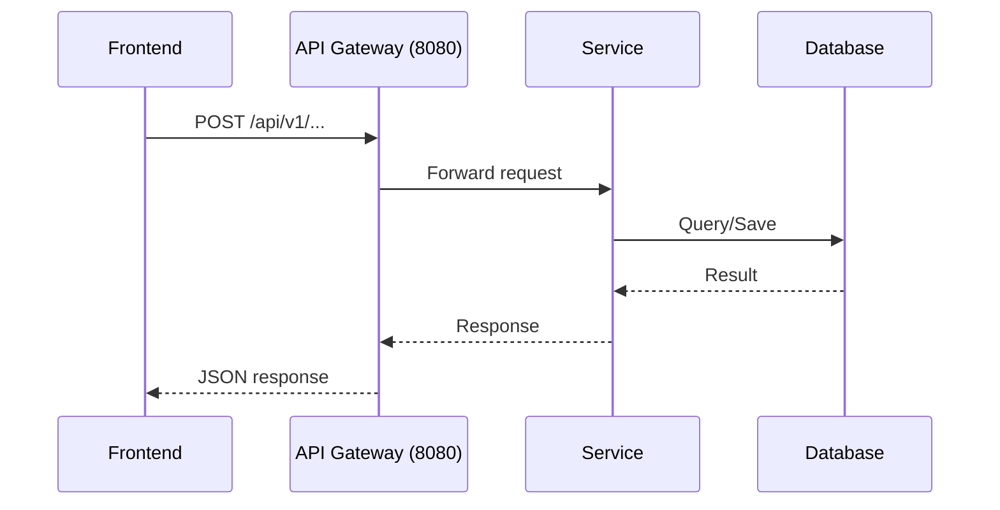
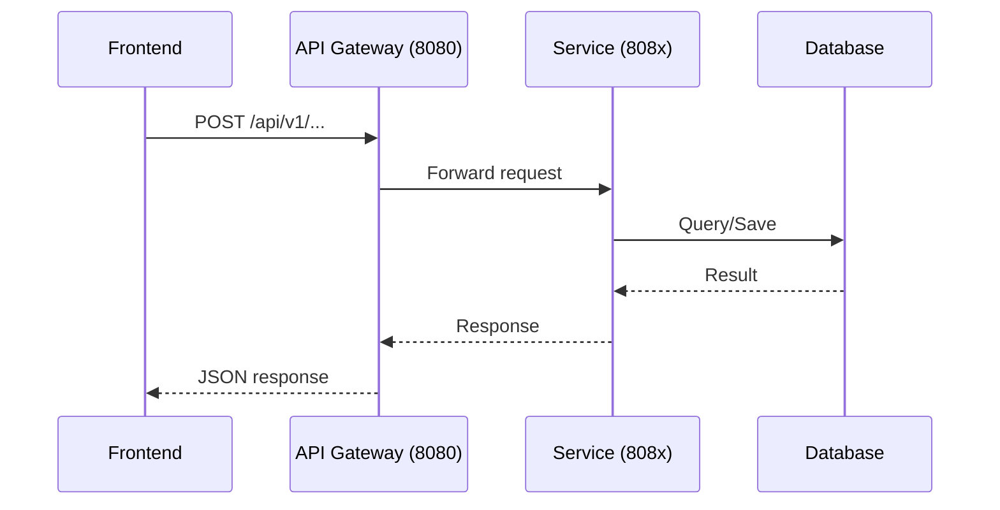
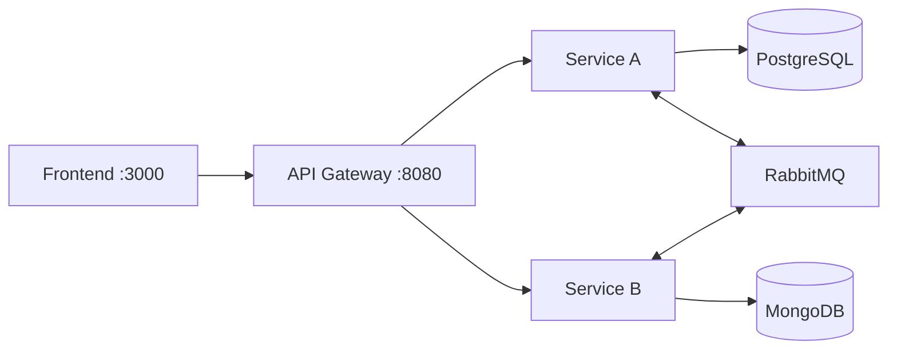

# Document Feature Skill

**This is Step 1** of the feature implementation workflow:
1. ✅ **Feature Docs** → `docs/feature-docs/<feature-name>.md`
2. API Docs → `docs/api-docs/<feature-name>.postman.json`
3. Implementation → actual code

---

## When to Use

Create feature docs **BEFORE** writing any code or API docs. This is the design phase.

## Output Location

All feature documentation goes in: `docs/feature-docs/<feature-name>.md`

---

## Feature Doc Template

```markdown
# Feature Name

## Purpose
Brief description of what this feature does and why it's needed.

## Services Involved
| Service | Role |
|---------|------|
| user-service | Handles authentication |
| order-service | Creates and manages orders |

## Flow Diagram



## API Endpoints (High-Level)
| Method | Endpoint | Description |
|--------|----------|-------------|
| POST | `/api/v1/orders` | Create new order |
| GET | `/api/v1/orders/{id}` | Get order details |

## Data Models
Describe key entities and DTOs involved.

## Configuration
Required `application.yml` settings or environment variables.

## Dependencies
- External services or libraries needed
- Database schema changes

## Acceptance Criteria
- [ ] User can create an order
- [ ] Order status is tracked
- [ ] Notifications are sent
```

---

## Step-by-Step Process

### Step 1: Research
```bash
# Find related source files
find_by_name Pattern="*Order*" in <service>/src/main/java

# Search for existing implementations
grep_search Query="WebClient" for inter-service calls
grep_search Query="@RabbitListener" for async flows
```

### Step 2: Create Feature Doc
1. Create `docs/feature-docs/<feature-name>.md`
2. Fill in the template sections
3. Use mermaid diagrams for complex flows

### Step 3: Review & Proceed
After feature doc is complete, proceed to **API Docs** (Step 2 of workflow).

---

## Mermaid Diagram Templates

### Sequence Diagram


### Component Diagram


---

## Project Context

| Component | Details |
|-----------|---------|
| Backend | Java 17+ / Spring Boot 3.2+ |
| Services | user, product, order, payment, notification |
| Infrastructure | Config Server, Eureka, API Gateway |
| Databases | PostgreSQL, MongoDB, Redis |
| Messaging | RabbitMQ |
| Ports | Gateway 8080, User 8081, Product 8082, Order 8083, Payment 8084, Notification 8085 |
---
