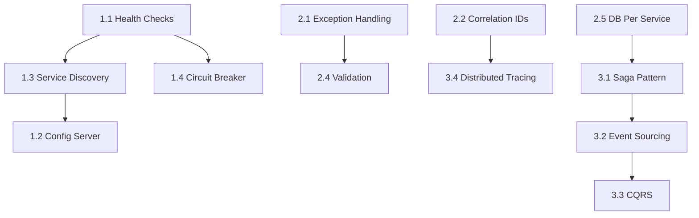

# 🚀 Microservices Enhancement Roadmap

> A structured learning path to enhance the e-commerce microservices project with industry-standard patterns and best practices.

---

## 📊 Progress Overview

| Tier | Category | Completed | Total |
|------|----------|-----------|-------|
| 🟢 Tier 1 | Essential Patterns | 4 | 4 |
| 🟡 Tier 2 | Core Concepts | 5 | 5 |
| 🔵 Tier 3 | Advanced Patterns | 0 | 4 |
| 🟣 Frontend | Basic UI | 0 | 1 |
| **Total** | | **9** | **14** |

---

## 🟢 TIER 1: Essential Microservice Patterns
> **Priority:** HIGH | **Difficulty:** Beginner-Friendly | **Impact:** Foundation for production-ready services

### [x] 1.1 Health Checks with Dependencies ✅
**Difficulty:** ⭐ Easy | **Estimated Time:** 1-2 hours | **Status:** COMPLETED

**Current State:**
- Services run without health indicators
- No visibility into database/queue connectivity

**What to Do:**
- [ ] Add `spring-boot-starter-actuator` to all services
- [ ] Configure `/actuator/health` endpoint with dependency checks
- [ ] Add health indicators for PostgreSQL, MongoDB, Redis, RabbitMQ
- [ ] Add health check configuration in `docker-compose.yml`

**Files to Modify:**
- `*/build.gradle` - Add actuator dependency
- `*/src/main/resources/application.yml` - Configure health endpoints
- `docker-compose.yml` - Add healthcheck configurations

**Learning Resources:**
- [Spring Boot Actuator Docs](https://docs.spring.io/spring-boot/docs/current/reference/html/actuator.html)

---

### [x] 1.2 Centralized Configuration (Spring Cloud Config) ✅
**Difficulty:** ⭐⭐ Medium | **Estimated Time:** 3-4 hours | **Status:** COMPLETED

**Current State:**
- Each service has its own `application.yml`
- Configuration changes require service restart

**What to Do:**
- [ ] Create new `config-server` service
- [ ] Create Git repository for configurations (can be local)
- [ ] Update all services to fetch config from Config Server
- [ ] Add `bootstrap.yml` to each service

**New Files to Create:**
```
config-server/
├── src/main/java/.../ConfigServerApplication.java
├── src/main/resources/application.yml
├── build.gradle
└── Dockerfile

config-repo/
├── user-service.yml
├── product-service.yml
├── order-service.yml
├── payment-service.yml
├── notification-service.yml
└── application.yml (shared config)
```

**Learning Resources:**
- [Spring Cloud Config Docs](https://spring.io/projects/spring-cloud-config)

---

### [x] 1.3 Service Discovery (Eureka) ✅
**Difficulty:** ⭐⭐ Medium | **Estimated Time:** 3-4 hours | **Status:** COMPLETED

**Current State:**
- Hardcoded service URLs in code: `http://product-service:8080`
- No dynamic service registration

**What to Do:**
- [ ] Create new `discovery-service` (Eureka Server)
- [ ] Register all services as Eureka Clients
- [ ] Update WebClient calls to use service names via LoadBalancer
- [ ] Update API Gateway to use Eureka for routing

**New Files to Create:**
```
discovery-service/
├── src/main/java/.../DiscoveryServiceApplication.java
├── src/main/resources/application.yml
├── build.gradle
└── Dockerfile
```

**Files to Modify:**
- All service `build.gradle` - Add Eureka Client dependency
- All service `application.yml` - Add Eureka client config
- `docker-compose.yml` - Add discovery-service

**Learning Resources:**
- [Spring Cloud Netflix Eureka](https://spring.io/guides/gs/service-registration-and-discovery/)

---

### [x] 1.4 Circuit Breaker (Resilience4j) ✅
**Difficulty:** ⭐⭐ Medium | **Estimated Time:** 2-3 hours | **Status:** COMPLETED

**Current State:**
- `OrderService` makes synchronous calls to `ProductService`
- No handling for service unavailability
- Failures can cascade across services

**What to Do:**
- [ ] Add Resilience4j dependency to `order-service`
- [ ] Wrap WebClient calls with `@CircuitBreaker`
- [ ] Implement fallback methods for graceful degradation
- [ ] Add retry configuration for transient failures
- [ ] Add circuit breaker metrics to actuator

**Files to Modify:**
- `order-service/build.gradle`
- `order-service/.../service/OrderService.java`
- `order-service/.../config/Resilience4jConfig.java` (new)
- `order-service/src/main/resources/application.yml`

**Example Implementation:**
```java
@CircuitBreaker(name = "product-service", fallbackMethod = "getProductFallback")
@Retry(name = "product-service")
public Map<String, Object> getProductInfo(Long productId) {
    // existing WebClient call
}

public Map<String, Object> getProductFallback(Long productId, Exception e) {
    log.warn("Fallback triggered for product: {}", productId);
    throw new ServiceUnavailableException("Product service temporarily unavailable");
}
```

**Learning Resources:**
- [Resilience4j Documentation](https://resilience4j.readme.io/docs/getting-started)

---

## 🟡 TIER 2: Core Concepts Enhancement
> **Priority:** MEDIUM | **Difficulty:** Intermediate | **Impact:** Better code quality and maintainability

### [x] 2.1 Global Exception Handling ✅
**Difficulty:** ⭐⭐ Medium | **Estimated Time:** 2-3 hours | **Status:** COMPLETED

**Current State:**
- ~~No centralized error handling~~ → GlobalExceptionHandler with @RestControllerAdvice
- ~~Raw exceptions returned to clients~~ → Standardized ErrorResponse DTO
- ~~Inconsistent error response formats~~ → Same shape across user-service & product-service

**What to Do:**
- [x] Create custom exceptions: `ResourceNotFoundException`, `BusinessException`
- [x] Create `GlobalExceptionHandler` with `@RestControllerAdvice`
- [x] Create standardized `ErrorResponse` DTO (with correlationId, fieldErrors for validation)
- [x] Apply to user-service and product-service

**New Files Created (per service):**
```
src/main/java/.../exception/
├── GlobalExceptionHandler.java
├── ResourceNotFoundException.java
├── BusinessException.java
└── ErrorResponse.java
```

---

### [x] 2.2 Request Correlation/Tracing IDs ✅
**Difficulty:** ⭐⭐ Medium | **Estimated Time:** 2-3 hours | **Status:** COMPLETED

**Current State:**
- ~~No way to trace requests across services~~ → X-Correlation-ID propagated
- API Gateway generates/forwards correlation ID; services use CorrelationIdFilter + MDC

**What to Do:**
- [x] Add MDC filter (CorrelationIdFilter) in user-service and product-service
- [x] Generate correlation ID if not present (X-Correlation-ID header)
- [x] Pass correlation ID in gateway→service calls (LoggingGlobalFilter forwards header)
- [x] Include correlation ID in log pattern (logging.pattern.console with %X{correlationId})
- [x] Return correlation ID in ErrorResponse when present

**Files Created:**
```
user-service/.../filter/CorrelationIdFilter.java
product-service/.../filter/CorrelationIdFilter.java
api-gateway LoggingGlobalFilter updated to use X-Correlation-ID
```

---

### [x] 2.3 API Versioning ✅
**Difficulty:** ⭐ Easy | **Estimated Time:** 1-2 hours | **Status:** COMPLETED

**Current State:**
- ~~APIs use `/api/users/**`~~ → All use `/api/v1/users/**`, `/api/v1/products/**`, etc.
- Version prefix applied at gateway and in each service controller

**What to Do:**
- [x] Update all endpoints to use `/api/v1/` prefix (user-service, product-service controllers)
- [x] Update API Gateway routes (GatewayConfig) and JWT filter paths
- [ ] Update frontend API client base URLs when frontend exists
- [ ] Document versioning strategy (optional)

**Files Modified:**
- UserController, AuthController: `@RequestMapping("/api/v1/users")`
- ProductController: `@RequestMapping("/api/v1/products")`
- GatewayConfig: all routes use `/api/v1/...`
- WebSecurityConfig, JwtAuthenticationFilter: paths updated to `/api/v1/...`

---

### [x] 2.4 Input Validation (Bean Validation) ✅
**Difficulty:** ⭐ Easy | **Estimated Time:** 1-2 hours | **Status:** COMPLETED

**Current State:**
- ~~DTOs lack validation annotations~~ → UserRegistrationRequest, LoginRequest, ProductCreateDTO, SearchRequestDTO have annotations
- ~~Invalid input can cause database errors~~ → MethodArgumentNotValidException handled by GlobalExceptionHandler with fieldErrors

**What to Do:**
- [x] Add `@Valid` to controller method parameters (register, login, createProduct, updateProduct, searchProducts)
- [x] Add validation annotations to DTOs (`@NotBlank`, `@Email`, `@Size`, `@DecimalMin`, etc.)
- [x] Handle `MethodArgumentNotValidException` in GlobalExceptionHandler
- [x] Return user-friendly validation error messages (ErrorResponse with fieldErrors)

**Files Modified:**
- UserRegistrationRequest, LoginRequest: @Size, @Email, @NotBlank
- ProductCreateDTO: @Size(max) for name, description
- SearchRequestDTO: new DTO with @NotBlank @Size for search query
- GlobalExceptionHandler: handleValidationException returns ErrorResponse with fieldErrors

---

### [x] 2.5 Database Per Service (True Separation) ✅
**Difficulty:** ⭐⭐ Medium | **Estimated Time:** 2-3 hours | **Status:** COMPLETED (for user & product)

**Current State:**
- ~~All services share one database~~ → user-service uses `user_service_db`, product-service uses `product_db`
- Each service's docker-compose has its own Postgres (and product has Redis); config-repo points each service to its DB

**What to Do:**
- [x] Separate PostgreSQL per service (user-service/docker-compose: user-db → user_service_db; product-service/docker-compose: product-db → product_db)
- [x] Each service's datasource in config-repo points to its own DB URL
- [x] Init scripts per database: `z-init-db/user_service_db.sql`, `z-init-db/product_db.sql`
- [ ] When order-service, payment-service, notification-service are added: give each its own Postgres (and DB name) in their docker-compose and config

---

## 🔵 TIER 3: Advanced Patterns
> **Priority:** LOW | **Difficulty:** Advanced | **Impact:** Deep understanding of distributed systems

### [ ] 3.1 Saga Pattern (Orchestration) 🚧
**Difficulty:** ⭐⭐⭐ Hard | **Estimated Time:** 6-8 hours | **Status:** PARTIALLY IMPLEMENTED

**Current State:**
- ~~Order creation updates stock but no rollback on payment failure~~ → `SagaOrderService` creates orders as `PENDING`, reserves inventory, processes payment, and cancels on failure
- ~~No compensation logic for failed transactions~~ → compensation is implemented for inventory release on create failure and refund + inventory release on cancel
- Remaining gaps: no explicit saga step/state persistence beyond `OrderStatus`, error semantics are not fully aligned with the feature docs, and test coverage is still minimal

**What to Do:**
- [x] Create saga orchestrator service (`SagaOrderService`)
- [x] Implement step-by-step transaction with compensation
- [ ] Add explicit saga step/state management beyond `OrderStatus`
- [x] Handle partial failures with rollback/compensation

**Saga Flow:**
```
1. Create Order (PENDING) → Success → Continue / Fail → End
2. Reserve Inventory      → Success → Continue / Fail → Cancel Order
3. Process Payment        → Success → Continue / Fail → Restore Inventory, Cancel Order
4. Confirm Order          → Success → Send Notification / Fail → Refund, Restore, Cancel
```

---

### [ ] 3.2 Event Sourcing (Lite Version)
**Difficulty:** ⭐⭐ Medium | **Estimated Time:** 3-4 hours

**Current State:**
- Only current order state is stored
- No history of state changes

**What to Do:**
- [ ] Create `OrderEvent` entity/table
- [ ] Store events for all order state changes
- [ ] Add endpoint to view order history from events
- [ ] Consider event replay capability

**New Tables:**
```sql
CREATE TABLE order_events (
    id BIGSERIAL PRIMARY KEY,
    order_id BIGINT NOT NULL,
    event_type VARCHAR(50) NOT NULL,
    event_data JSONB,
    created_at TIMESTAMP DEFAULT NOW()
);
```

---

### [ ] 3.3 CQRS (Simple Implementation)
**Difficulty:** ⭐⭐ Medium | **Estimated Time:** 3-4 hours

**Current State:**
- Same repository for read and write operations
- Product search could benefit from read optimization

**What to Do:**
- [ ] Create separate read model for Product listing/search
- [ ] Add read-optimized database view or table
- [ ] Separate query endpoints from command endpoints
- [ ] Sync write model to read model via events

---

### [ ] 3.4 Distributed Tracing (Zipkin)
**Difficulty:** ⭐⭐ Medium | **Estimated Time:** 2-3 hours

**Current State:**
- Manual correlation ID tracking (if implemented from 2.2)
- No visual trace timeline

**What to Do:**
- [ ] Add Zipkin server to docker-compose
- [ ] Add Spring Cloud Sleuth dependency to all services
- [ ] Configure trace sampling
- [ ] Access Zipkin UI at `http://localhost:9411`

**docker-compose addition:**
```yaml
zipkin:
  image: openzipkin/zipkin
  ports:
    - "9411:9411"
```

---

## 🟣 FRONTEND: Basic UI for Backend Services
> **Priority:** MEDIUM | **Difficulty:** Beginner–Intermediate | **Impact:** End-to-end demo and manual testing of APIs

### [ ] F.1 Basic Frontend Application
**Difficulty:** ⭐⭐ Medium | **Estimated Time:** 4–6 hours

**Current State:**
- No frontend; APIs are exercised via Postman or curl only.
- Backend exposes user-service (auth, profile) and product-service (CRUD, search) via API Gateway at `/api/v1/`.

**Goal:**
- Provide a **basic UI** that talks to the API Gateway so users can register, login, view profile, list products, view product detail, and search products—without building a full e‑commerce experience.

**What to Do:**
- [ ] Create a frontend app (recommended: **Vue.js 3** + **Pinia** + **Vuetify** per project README, or React + similar).
- [ ] Configure API client to use **API Gateway base URL** (e.g. `http://localhost:8080`) and **versioned paths** (`/api/v1/users`, `/api/v1/products`).
- [ ] Implement **auth flow**: Register, Login, store JWT (e.g. localStorage/sessionStorage), send `Authorization: Bearer <token>` on protected requests; optional logout.
- [ ] Implement **user-facing pages**: Login/Register forms, optional Profile view (GET/PUT profile using headers from gateway).
- [ ] Implement **product-facing pages**: Product list (GET paginated), Product detail (GET by id), Search (POST `/api/v1/products/search` with `{ "query": "..." }`).
- [ ] Display API errors using the backend **ErrorResponse** shape (message, status, optional fieldErrors) where applicable.
- [ ] Optional: simple nav (e.g. Home, Products, Login/Register or Profile) and basic loading/error states.

**Suggested Structure:**
```
frontend/
├── package.json
├── vite.config.js (or vue-cli)
├── index.html
├── src/
│   ├── main.js
│   ├── App.vue
│   ├── api/
│   │   ├── client.js          # Axios/fetch base URL = gateway, /api/v1
│   │   ├── auth.js             # register, login
│   │   └── products.js         # list, get, search
│   ├── stores/
│   │   └── auth.js             # Pinia: user, token, login, logout
│   ├── views/
│   │   ├── HomeView.vue
│   │   ├── LoginView.vue
│   │   ├── RegisterView.vue
│   │   ├── ProfileView.vue
│   │   ├── ProductListView.vue
│   │   └── ProductDetailView.vue
│   ├── components/             # optional: ProductCard, AppNav, etc.
│   └── router/
│       └── index.js
└── README.md                   # how to run (npm install, npm run dev, gateway URL)
```

**API Endpoints to Use (via Gateway):**
| Feature        | Method | Path |
|----------------|--------|------|
| Register       | POST   | `/api/v1/users/register` |
| Login          | POST   | `/api/v1/users/login` |
| Get profile    | GET    | `/api/v1/users/profile` (requires JWT) |
| Update profile | PUT    | `/api/v1/users/profile` (requires JWT) |
| List products  | GET    | `/api/v1/products?page=0&size=20&sortBy=name&sortDir=asc` |
| Get product    | GET    | `/api/v1/products/{id}` |
| Search products| POST   | `/api/v1/products/search` body `{ "query": "..." }` |

**Files to Create/Modify:**
- New `frontend/` directory and files as above.
- Optional: root `docker-compose.yml` or `frontend/README.md` with env var for gateway URL (e.g. `VITE_API_BASE_URL=http://localhost:8080`).

**Notes:**
- Keep UI minimal: forms, tables/cards, and basic navigation are enough.
- CORS must allow the frontend origin if running on a different port (e.g. 5173); API Gateway/CorsConfig may need to allow it.
- Completing this satisfies the “Update frontend API client base URLs” item referenced in 2.3 API Versioning.

---

## 📋 Quick Reference: Enhancement Dependencies



---

## 🎯 Suggested Implementation Order

### Week 1-2: Foundation
1. [ ] 1.1 Health Checks
2. [ ] 2.1 Global Exception Handling
3. [ ] 2.4 Input Validation
4. [ ] 2.3 API Versioning

### Week 3-4: Resilience
5. [ ] 1.4 Circuit Breaker
6. [ ] 2.2 Correlation IDs
7. [ ] 1.3 Service Discovery

### Week 5-6: Configuration & Separation
8. [ ] 1.2 Centralized Configuration
9. [ ] 2.5 Database Per Service

### Week 7-8: Advanced (Optional)
10. [ ] 3.4 Distributed Tracing
11. [ ] 3.1 Saga Pattern
12. [ ] 3.2 Event Sourcing
13. [ ] 3.3 CQRS

### Frontend (any time after Tier 2)
14. [ ] F.1 Basic Frontend Application — Login, Register, Profile, Product list/detail, Search using `/api/v1/` via Gateway

---

## 📝 Notes

- Each enhancement is designed to be implemented independently
- Start with Tier 1 items for maximum learning value
- Test thoroughly after each enhancement before moving to the next
- Update this file as you complete items: `[ ]` → `[x]`
- **Frontend (F.1)** can be done once Tier 2 is in place so the UI uses versioned APIs (`/api/v1/`) and standardized error responses.

---

*Last Updated: 2026-02-06*
