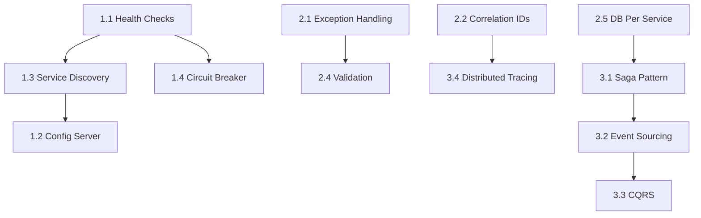

# 🚀 Microservices Enhancement Roadmap

> A structured learning path to enhance the e-commerce microservices project with industry-standard patterns and best practices.

---

## 📊 Progress Overview

| Tier | Category | Completed | Total |
|------|----------|-----------|-------|
| 🟢 Tier 1 | Essential Patterns | 0 | 4 |
| 🟡 Tier 2 | Core Concepts | 0 | 5 |
| 🔵 Tier 3 | Advanced Patterns | 0 | 4 |
| **Total** | | **0** | **13** |

---

## 🟢 TIER 1: Essential Microservice Patterns
> **Priority:** HIGH | **Difficulty:** Beginner-Friendly | **Impact:** Foundation for production-ready services

### [ ] 1.1 Health Checks with Dependencies
**Difficulty:** ⭐ Easy | **Estimated Time:** 1-2 hours

**Current State:**
- Services run without health indicators
- No visibility into database/queue connectivity

**What to Do:**
- [ ] Add `spring-boot-starter-actuator` to all services
- [ ] Configure `/actuator/health` endpoint with dependency checks
- [ ] Add health indicators for PostgreSQL, MongoDB, Redis, RabbitMQ
- [ ] Add health check configuration in `docker-compose.yml`

**Files to Modify:**
- `*/build.gradle` - Add actuator dependency
- `*/src/main/resources/application.yml` - Configure health endpoints
- `docker-compose.yml` - Add healthcheck configurations

**Learning Resources:**
- [Spring Boot Actuator Docs](https://docs.spring.io/spring-boot/docs/current/reference/html/actuator.html)

---

### [ ] 1.2 Centralized Configuration (Spring Cloud Config)
**Difficulty:** ⭐⭐ Medium | **Estimated Time:** 3-4 hours

**Current State:**
- Each service has its own `application.yml`
- Configuration changes require service restart

**What to Do:**
- [ ] Create new `config-server` service
- [ ] Create Git repository for configurations (can be local)
- [ ] Update all services to fetch config from Config Server
- [ ] Add `bootstrap.yml` to each service

**New Files to Create:**
```
config-server/
├── src/main/java/.../ConfigServerApplication.java
├── src/main/resources/application.yml
├── build.gradle
└── Dockerfile

config-repo/
├── user-service.yml
├── product-service.yml
├── order-service.yml
├── payment-service.yml
├── notification-service.yml
└── application.yml (shared config)
```

**Learning Resources:**
- [Spring Cloud Config Docs](https://spring.io/projects/spring-cloud-config)

---

### [ ] 1.3 Service Discovery (Eureka)
**Difficulty:** ⭐⭐ Medium | **Estimated Time:** 3-4 hours

**Current State:**
- Hardcoded service URLs in code: `http://product-service:8080`
- No dynamic service registration

**What to Do:**
- [ ] Create new `discovery-service` (Eureka Server)
- [ ] Register all services as Eureka Clients
- [ ] Update WebClient calls to use service names via LoadBalancer
- [ ] Update API Gateway to use Eureka for routing

**New Files to Create:**
```
discovery-service/
├── src/main/java/.../DiscoveryServiceApplication.java
├── src/main/resources/application.yml
├── build.gradle
└── Dockerfile
```

**Files to Modify:**
- All service `build.gradle` - Add Eureka Client dependency
- All service `application.yml` - Add Eureka client config
- `docker-compose.yml` - Add discovery-service

**Learning Resources:**
- [Spring Cloud Netflix Eureka](https://spring.io/guides/gs/service-registration-and-discovery/)

---

### [ ] 1.4 Circuit Breaker (Resilience4j)
**Difficulty:** ⭐⭐ Medium | **Estimated Time:** 2-3 hours

**Current State:**
- `OrderService` makes synchronous calls to `ProductService`
- No handling for service unavailability
- Failures can cascade across services

**What to Do:**
- [ ] Add Resilience4j dependency to `order-service`
- [ ] Wrap WebClient calls with `@CircuitBreaker`
- [ ] Implement fallback methods for graceful degradation
- [ ] Add retry configuration for transient failures
- [ ] Add circuit breaker metrics to actuator

**Files to Modify:**
- `order-service/build.gradle`
- `order-service/.../service/OrderService.java`
- `order-service/.../config/Resilience4jConfig.java` (new)
- `order-service/src/main/resources/application.yml`

**Example Implementation:**
```java
@CircuitBreaker(name = "product-service", fallbackMethod = "getProductFallback")
@Retry(name = "product-service")
public Map<String, Object> getProductInfo(Long productId) {
    // existing WebClient call
}

public Map<String, Object> getProductFallback(Long productId, Exception e) {
    log.warn("Fallback triggered for product: {}", productId);
    throw new ServiceUnavailableException("Product service temporarily unavailable");
}
```

**Learning Resources:**
- [Resilience4j Documentation](https://resilience4j.readme.io/docs/getting-started)

---

## 🟡 TIER 2: Core Concepts Enhancement
> **Priority:** MEDIUM | **Difficulty:** Intermediate | **Impact:** Better code quality and maintainability

### [ ] 2.1 Global Exception Handling
**Difficulty:** ⭐⭐ Medium | **Estimated Time:** 2-3 hours

**Current State:**
- No centralized error handling
- Raw exceptions returned to clients
- Inconsistent error response formats

**What to Do:**
- [ ] Create custom exceptions: `ResourceNotFoundException`, `BusinessException`, `ValidationException`
- [ ] Create `GlobalExceptionHandler` with `@RestControllerAdvice`
- [ ] Create standardized `ErrorResponse` DTO
- [ ] Apply to all services

**New Files to Create (per service):**
```
src/main/java/com/microservices/{service}/exception/
├── GlobalExceptionHandler.java
├── ResourceNotFoundException.java
├── BusinessException.java
├── ValidationException.java
└── ErrorResponse.java
```

---

### [ ] 2.2 Request Correlation/Tracing IDs
**Difficulty:** ⭐⭐ Medium | **Estimated Time:** 2-3 hours

**Current State:**
- No way to trace requests across services
- Difficult to debug issues in distributed calls

**What to Do:**
- [ ] Add MDC (Mapped Diagnostic Context) filter
- [ ] Generate correlation ID if not present in request header
- [ ] Pass correlation ID in all service-to-service calls
- [ ] Include correlation ID in all log messages
- [ ] Return correlation ID in API responses

**Files to Create:**
```
src/main/java/com/microservices/{service}/filter/
├── CorrelationIdFilter.java
└── WebClientCorrelationInterceptor.java
```

---

### [ ] 2.3 API Versioning
**Difficulty:** ⭐ Easy | **Estimated Time:** 1-2 hours

**Current State:**
- APIs use `/api/users/**`, `/api/products/**`
- No version management strategy

**What to Do:**
- [ ] Update all endpoints to use `/api/v1/` prefix
- [ ] Update API Gateway routes
- [ ] Update frontend API client base URLs
- [ ] Document versioning strategy

**Files to Modify:**
- All `*Controller.java` files - Update `@RequestMapping`
- `api-gateway/.../config/GatewayConfig.java`
- `frontend/src/services/apiClient.js`

---

### [ ] 2.4 Input Validation (Bean Validation)
**Difficulty:** ⭐ Easy | **Estimated Time:** 1-2 hours

**Current State:**
- DTOs lack validation annotations
- Invalid input can cause database errors

**What to Do:**
- [ ] Add `@Valid` to controller method parameters
- [ ] Add validation annotations to DTOs (`@NotNull`, `@Email`, `@Size`, etc.)
- [ ] Handle `MethodArgumentNotValidException` in GlobalExceptionHandler
- [ ] Return user-friendly validation error messages

**Files to Modify:**
- All `*Request.java` DTOs
- All `*Controller.java` files
- `GlobalExceptionHandler.java`

**Example:**
```java
public class UserRegistrationRequest {
    @NotBlank(message = "Username is required")
    @Size(min = 3, max = 50, message = "Username must be 3-50 characters")
    private String username;
    
    @NotBlank(message = "Email is required")
    @Email(message = "Invalid email format")
    private String email;
    
    @NotBlank(message = "Password is required")
    @Size(min = 8, message = "Password must be at least 8 characters")
    private String password;
}
```

---

### [ ] 2.5 Database Per Service (True Separation)
**Difficulty:** ⭐⭐ Medium | **Estimated Time:** 2-3 hours

**Current State:**
- All services share `microservices_db` database
- Not true database-per-service pattern

**What to Do:**
- [ ] Create separate PostgreSQL instances or schemas
- [ ] Update `docker-compose.yml` with separate database services
- [ ] Update each service's datasource configuration
- [ ] Create initialization scripts per database

**Updated docker-compose.yml structure:**
```yaml
services:
  postgres-user:
    image: postgres:13
    environment:
      POSTGRES_DB: user_db
  
  postgres-product:
    image: postgres:13
    environment:
      POSTGRES_DB: product_db
  
  postgres-order:
    image: postgres:13
    environment:
      POSTGRES_DB: order_db
  
  postgres-payment:
    image: postgres:13
    environment:
      POSTGRES_DB: payment_db
```

---

## 🔵 TIER 3: Advanced Patterns
> **Priority:** LOW | **Difficulty:** Advanced | **Impact:** Deep understanding of distributed systems

### [ ] 3.1 Saga Pattern (Orchestration)
**Difficulty:** ⭐⭐⭐ Hard | **Estimated Time:** 6-8 hours

**Current State:**
- Order creation updates stock but no rollback on payment failure
- No compensation logic for failed transactions

**What to Do:**
- [ ] Create `OrderSaga` orchestrator class
- [ ] Implement step-by-step transaction with compensation
- [ ] Add saga state management
- [ ] Handle partial failures with rollback

**Saga Flow:**
```
1. Create Order (PENDING) → Success → Continue / Fail → End
2. Reserve Inventory      → Success → Continue / Fail → Cancel Order
3. Process Payment        → Success → Continue / Fail → Restore Inventory, Cancel Order
4. Confirm Order          → Success → Send Notification / Fail → Refund, Restore, Cancel
```

---

### [ ] 3.2 Event Sourcing (Lite Version)
**Difficulty:** ⭐⭐ Medium | **Estimated Time:** 3-4 hours

**Current State:**
- Only current order state is stored
- No history of state changes

**What to Do:**
- [ ] Create `OrderEvent` entity/table
- [ ] Store events for all order state changes
- [ ] Add endpoint to view order history from events
- [ ] Consider event replay capability

**New Tables:**
```sql
CREATE TABLE order_events (
    id BIGSERIAL PRIMARY KEY,
    order_id BIGINT NOT NULL,
    event_type VARCHAR(50) NOT NULL,
    event_data JSONB,
    created_at TIMESTAMP DEFAULT NOW()
);
```

---

### [ ] 3.3 CQRS (Simple Implementation)
**Difficulty:** ⭐⭐ Medium | **Estimated Time:** 3-4 hours

**Current State:**
- Same repository for read and write operations
- Product search could benefit from read optimization

**What to Do:**
- [ ] Create separate read model for Product listing/search
- [ ] Add read-optimized database view or table
- [ ] Separate query endpoints from command endpoints
- [ ] Sync write model to read model via events

---

### [ ] 3.4 Distributed Tracing (Zipkin)
**Difficulty:** ⭐⭐ Medium | **Estimated Time:** 2-3 hours

**Current State:**
- Manual correlation ID tracking (if implemented from 2.2)
- No visual trace timeline

**What to Do:**
- [ ] Add Zipkin server to docker-compose
- [ ] Add Spring Cloud Sleuth dependency to all services
- [ ] Configure trace sampling
- [ ] Access Zipkin UI at `http://localhost:9411`

**docker-compose addition:**
```yaml
zipkin:
  image: openzipkin/zipkin
  ports:
    - "9411:9411"
```

---

## 📋 Quick Reference: Enhancement Dependencies



---

## 🎯 Suggested Implementation Order

### Week 1-2: Foundation
1. [ ] 1.1 Health Checks
2. [ ] 2.1 Global Exception Handling
3. [ ] 2.4 Input Validation
4. [ ] 2.3 API Versioning

### Week 3-4: Resilience
5. [ ] 1.4 Circuit Breaker
6. [ ] 2.2 Correlation IDs
7. [ ] 1.3 Service Discovery

### Week 5-6: Configuration & Separation
8. [ ] 1.2 Centralized Configuration
9. [ ] 2.5 Database Per Service

### Week 7-8: Advanced (Optional)
10. [ ] 3.4 Distributed Tracing
11. [ ] 3.1 Saga Pattern
12. [ ] 3.2 Event Sourcing
13. [ ] 3.3 CQRS

---

## 📝 Notes

- Each enhancement is designed to be implemented independently
- Start with Tier 1 items for maximum learning value
- Test thoroughly after each enhancement before moving to the next
- Update this file as you complete items: `[ ]` → `[x]`

---

*Last Updated: 2026-02-03*
