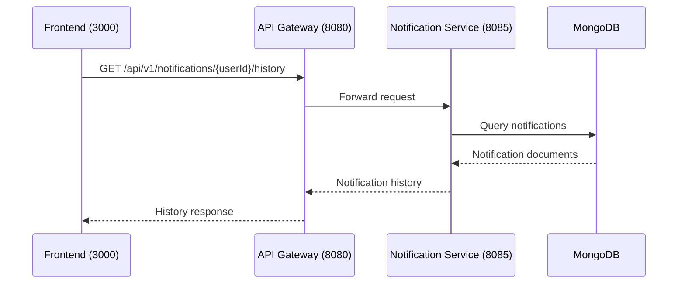

# Get Notification History

## Purpose
Retrieve notification history for a specific user.

## Service
**notification-service** (Port 8085)

## API Endpoint
| Method | Endpoint | Description |
|--------|----------|-------------|
| GET | `/api/v1/notifications/{userId}/history` | Get notification history |

## Flow Diagram



## Request Headers
| Header | Description |
|--------|-------------|
| Authorization | Bearer {JWT token} |

## Path Parameters
| Parameter | Type | Description |
|-----------|------|-------------|
| userId | Long | User ID |

## Response
```json
[
  {
    "id": "65abc123def456",
    "type": "EMAIL",
    "subject": "Order Confirmation",
    "status": "DELIVERED",
    "createdAt": "2026-02-05T10:00:00Z",
    "readAt": null
  },
  {
    "id": "65abc123def789",
    "type": "SMS",
    "subject": "Shipping Update",
    "status": "SENT",
    "createdAt": "2026-02-04T15:30:00Z",
    "readAt": "2026-02-04T16:00:00Z"
  }
]
```

### Error Responses
| Status | Description |
|--------|-------------|
| 401 | Unauthorized |
| 403 | Forbidden (not self or admin) |

## Acceptance Criteria
- [ ] View notification history by user
- [ ] Only owner or admin can access
