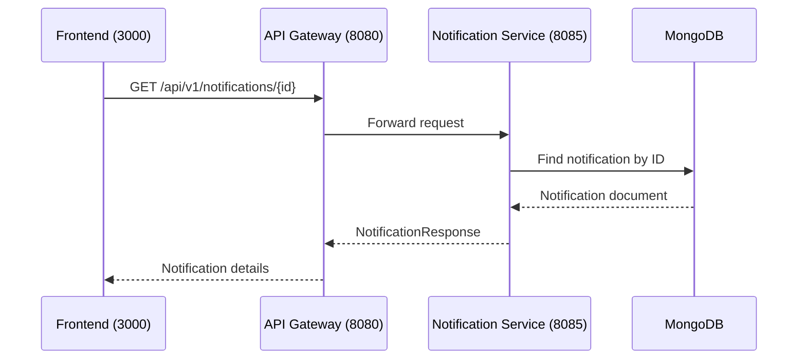

# Get Notification

## Purpose
Retrieve a single notification by ID.

## Service
**notification-service** (Port 8085)

## API Endpoint
| Method | Endpoint | Description |
|--------|----------|-------------|
| GET | `/api/v1/notifications/{id}` | Get notification by ID |

## Flow Diagram



## Request Headers
| Header | Description |
|--------|-------------|
| Authorization | Bearer {JWT token} |

## Path Parameters
| Parameter | Type | Description |
|-----------|------|-------------|
| id | String | Notification ID (MongoDB ObjectId) |

## Response
```json
{
  "id": "65abc123def456",
  "userId": 456,
  "type": "EMAIL",
  "channel": "smtp",
  "recipient": "user@example.com",
  "subject": "Order Confirmation",
  "content": "<h1>Your order...</h1>",
  "status": "DELIVERED",
  "event": "ORDER_CREATED",
  "eventId": "123",
  "createdAt": "2026-02-05T10:00:00Z",
  "readAt": null
}
```

### Error Responses
| Status | Description |
|--------|-------------|
| 401 | Unauthorized |
| 403 | Forbidden |
| 404 | Notification not found |

## Acceptance Criteria
- [ ] View notification details by ID
- [ ] Only owner or admin can access
