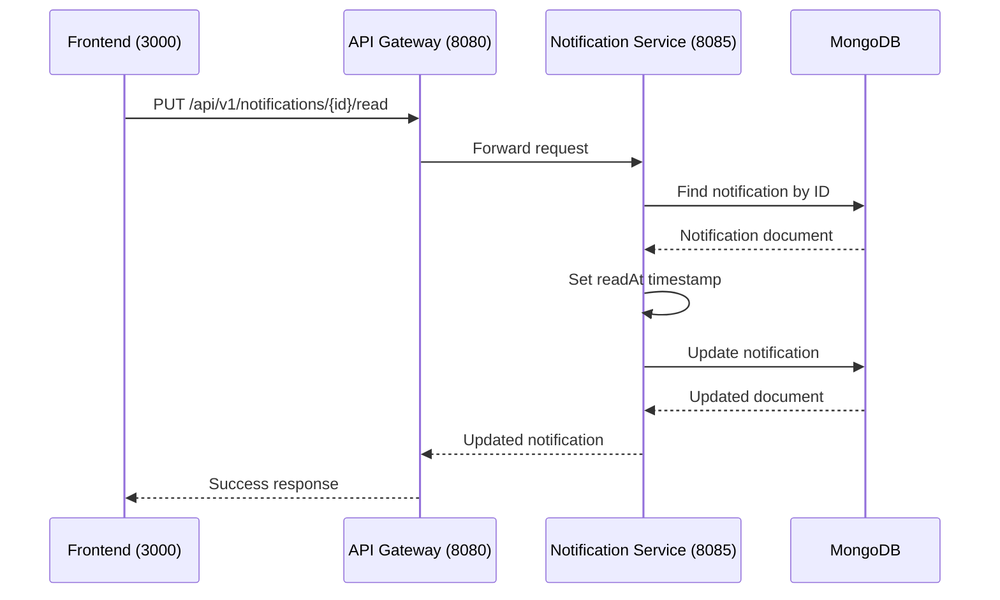

# Mark Notification Read

## Purpose
Mark a notification as read by the user.

## Service
**notification-service** (Port 8085)

## API Endpoint
| Method | Endpoint | Description |
|--------|----------|-------------|
| PUT | `/api/v1/notifications/{id}/read` | Mark as read |

## Flow Diagram



## Request Headers
| Header | Description |
|--------|-------------|
| Authorization | Bearer {JWT token} |

## Path Parameters
| Parameter | Type | Description |
|-----------|------|-------------|
| id | String | Notification ID |

## Response
```json
{
  "id": "65abc123def456",
  "status": "READ",
  "readAt": "2026-02-05T12:00:00Z"
}
```

### Error Responses
| Status | Description |
|--------|-------------|
| 401 | Unauthorized |
| 403 | Forbidden (not owner) |
| 404 | Notification not found |

## Acceptance Criteria
- [ ] Mark notifications as read
- [ ] Only owner can mark as read
- [ ] Record read timestamp
