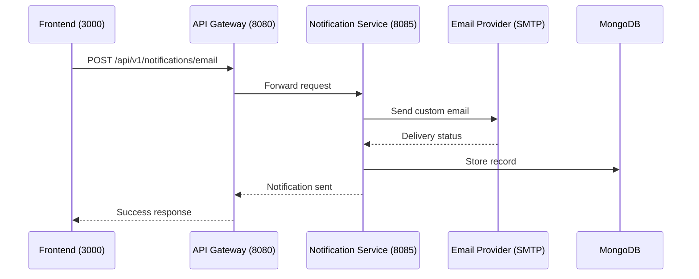

# Send Email

## Purpose
Send an email notification directly via API.

## Service
**notification-service** (Port 8085)

## API Endpoint
| Method | Endpoint | Description |
|--------|----------|-------------|
| POST | `/api/v1/notifications/email` | Send email directly |

## Flow Diagram



## Request Headers
| Header | Description |
|--------|-------------|
| Authorization | Bearer {JWT token} (Admin or internal) |

## Request Body
```json
{
  "userId": 456,
  "to": "user@example.com",
  "subject": "Order Confirmation",
  "body": "<h1>Your order has been confirmed</h1>",
  "isHtml": true
}
```

### Request Validation
| Field | Type | Validation |
|-------|------|------------|
| userId | Long | @NotNull |
| to | String | @Email, @NotBlank |
| subject | String | @NotBlank |
| body | String | @NotBlank |
| isHtml | Boolean | Default: false |

## Response
```json
{
  "id": "65abc123def456",
  "type": "EMAIL",
  "status": "SENT",
  "createdAt": "2026-02-05T10:00:00Z"
}
```

### Error Responses
| Status | Description |
|--------|-------------|
| 400 | Validation error |
| 401 | Unauthorized |
| 403 | Forbidden |
| 500 | Email delivery failed |

## Acceptance Criteria
- [ ] Send custom email via API
- [ ] Support HTML emails
- [ ] Store notification record in MongoDB
