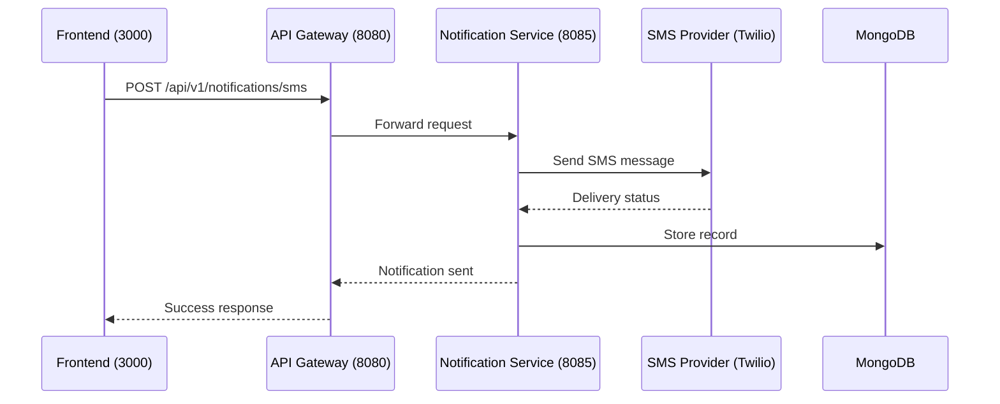

# Send SMS

## Purpose
Send an SMS notification directly via API.

## Service
**notification-service** (Port 8085)

## API Endpoint
| Method | Endpoint | Description |
|--------|----------|-------------|
| POST | `/api/v1/notifications/sms` | Send SMS directly |

## Flow Diagram



## Request Headers
| Header | Description |
|--------|-------------|
| Authorization | Bearer {JWT token} (Admin or internal) |

## Request Body
```json
{
  "userId": 456,
  "phoneNumber": "+1234567890",
  "message": "Your order has shipped! Tracking: TRK123"
}
```

### Request Validation
| Field | Type | Validation |
|-------|------|------------|
| userId | Long | @NotNull |
| phoneNumber | String | @NotBlank, valid format |
| message | String | @NotBlank, @Size(max=160) |

## Response
```json
{
  "id": "65abc123def789",
  "type": "SMS",
  "status": "SENT",
  "createdAt": "2026-02-05T10:00:00Z"
}
```

### Error Responses
| Status | Description |
|--------|-------------|
| 400 | Validation error |
| 401 | Unauthorized |
| 403 | Forbidden |
| 500 | SMS delivery failed |

## Configuration
```yaml
twilio:
  account-sid: ${TWILIO_ACCOUNT_SID}
  auth-token: ${TWILIO_AUTH_TOKEN}
  phone-number: ${TWILIO_PHONE_NUMBER}
```

## Acceptance Criteria
- [ ] Send SMS via Twilio API
- [ ] Validate phone number format
- [ ] Store notification record in MongoDB
