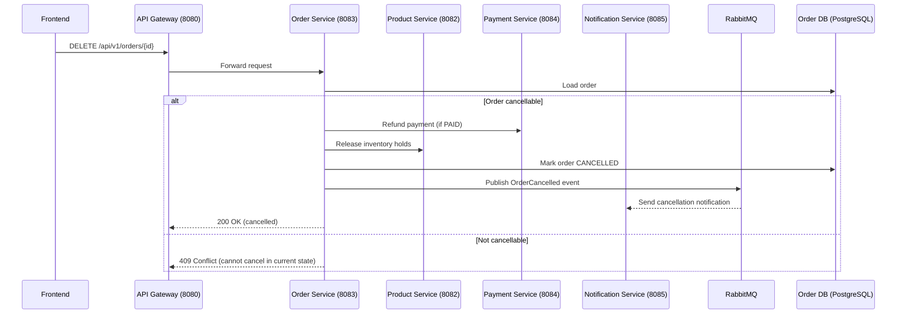

# Cancel Order (Saga Compensation)

## Purpose
Cancel an existing order and trigger compensation steps: refund payment (if captured), release reserved inventory, and emit cancellation events.

## Service
**order-service** (Port 8083 via API Gateway 8080)

## API Endpoint
| Method | Endpoint | Description |
|--------|----------|-------------|
| DELETE | `/api/v1/orders/{id}` | Cancel an order and execute compensation (refund + inventory release). |

## Flow Diagram

## Acceptance Criteria
- [ ] Only cancellable states (e.g., PENDING, PAID, PROCESSING) allowed; shipped/completed return 409.
- [ ] Refund is idempotent; repeated calls do not double-refund.
- [ ] Inventory release called only once per order; safe to retry.
- [ ] OrderCancelled event emitted for downstream consumers.
- [ ] Response includes correlationId for traceability.
