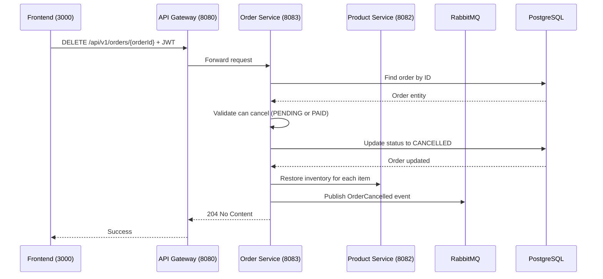

# Cancel Order

## Purpose
Cancel an order and restore reserved inventory.

## Service
**order-service** (Port 8083)

## API Endpoint
| Method | Endpoint | Description |
|--------|----------|-------------|
| DELETE | `/api/v1/orders/{orderId}` | Cancel order |

## Flow Diagram



## Request Headers
| Header | Description |
|--------|-------------|
| Authorization | Bearer {JWT token} |

## Path Parameters
| Parameter | Type | Description |
|-----------|------|-------------|
| orderId | Long | Order ID |

## Response
- **204 No Content** on success

### Error Responses
| Status | Description |
|--------|-------------|
| 400 | Cannot cancel (already shipped/delivered) |
| 401 | Unauthorized |
| 403 | Forbidden (not owner or admin) |
| 404 | Order not found |

## Cancellation Rules
- Can cancel: PENDING, PAID orders
- Cannot cancel: SHIPPED, DELIVERED orders
- Inventory is restored on cancellation

## RabbitMQ Event Published
```json
{
  "orderId": 123,
  "userId": 456,
  "reason": "User requested cancellation",
  "timestamp": "2026-02-05T12:00:00Z"
}
```

## Acceptance Criteria
- [ ] Cancel orders with status PENDING or PAID
- [ ] Restore inventory on cancellation
- [ ] Publish OrderCancelled event
