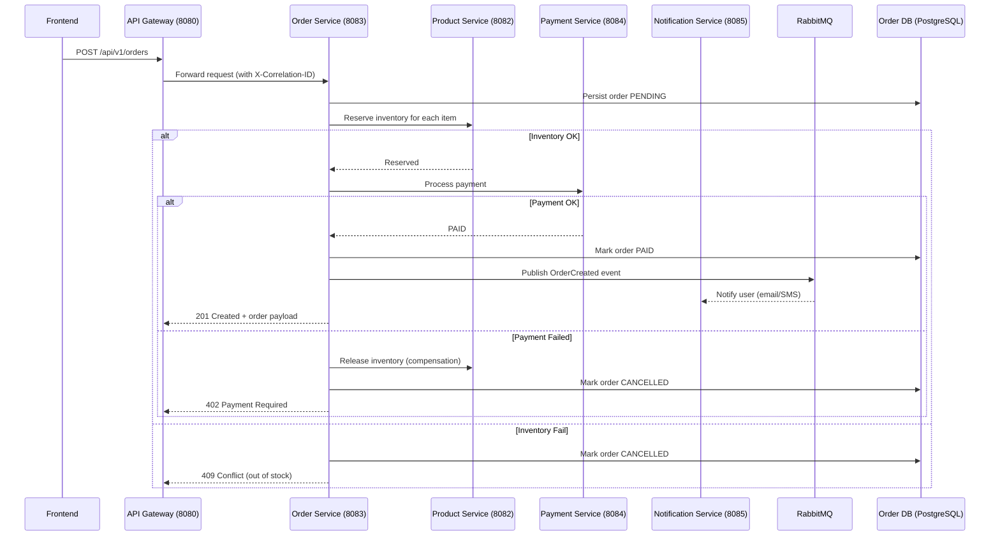

# Create Order (Saga Orchestration)

## Purpose
Create an order using a saga orchestrator that reserves inventory, processes payment, and triggers notifications with compensation on failure.

## Service
**order-service** (Port 8083 via API Gateway 8080)

## API Endpoint
| Method | Endpoint | Description |
|--------|----------|-------------|
| POST | `/api/v1/orders` | Create an order and orchestrate inventory reserve → payment → confirmation; compensates on failure. |

## Flow Diagram


## Request Body
```json
{
  "userId": 42,
  "items": [
    { "productId": 1001, "quantity": 2 },
    { "productId": 2002, "quantity": 1 }
  ],
  "paymentMethod": "CARD",
  "paymentToken": "tok_visa_123",
  "clientRequestId": "9b1deb4d-3b7d-4bad-9bdd-2b0d7b3dcb6d"
}
```
- `clientRequestId` acts as an idempotency key to prevent duplicate charges.

## Response
```json
{
  "id": 8742,
  "status": "PAID",
  "userId": 42,
  "items": [
    { "productId": 1001, "quantity": 2 },
    { "productId": 2002, "quantity": 1 }
  ],
  "totalAmount": 129.98,
  "createdAt": "2026-02-06T14:25:00Z",
  "correlationId": "f2f6f1c0-5a6b-4a2e-9f3e-1dcf8b4b8b1d"
}
```
- On payment failure: `402 Payment Required` with error message and correlationId.
- On inventory failure: `409 Conflict` with details per item.

## Acceptance Criteria
- [ ] Orders saved as `PENDING` before outbound calls; final states PAID or CANCELLED only.
- [ ] Inventory reservation failure returns 409 and does not charge payment.
- [ ] Payment failure triggers inventory release and returns 402.
- [ ] Idempotency enforced via `clientRequestId` to avoid duplicate orders/charges.
- [ ] Correlation ID propagated to downstream services and returned in responses.
- [ ] OrderCreated event published to RabbitMQ after successful payment.
