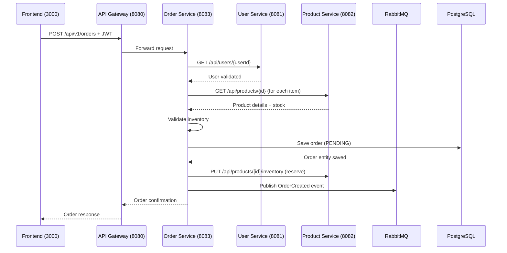

# Create Order

## Purpose
Create a new order with multiple items, validating user and product inventory.

## Service
**order-service** (Port 8083)

## API Endpoint
| Method | Endpoint | Description |
|--------|----------|-------------|
| POST | `/api/v1/orders` | Create new order |

## Flow Diagram



## Request Body
```json
{
  "userId": 1,
  "items": [
    {
      "productId": 101,
      "quantity": 2
    },
    {
      "productId": 102,
      "quantity": 1
    }
  ],
  "shippingAddress": "123 Main St, City, State 12345"
}
```

### Request Validation
| Field | Type | Validation |
|-------|------|------------|
| userId | Long | @NotNull |
| items | List\<OrderItemRequest\> | @NotEmpty |
| shippingAddress | String | @NotBlank |

### OrderItemRequest
| Field | Type | Validation |
|-------|------|------------|
| productId | Long | @NotNull |
| quantity | Integer | @NotNull, @Min(1) |

## Response
```json
{
  "id": 1,
  "userId": 1,
  "status": "PENDING",
  "totalAmount": 299.97,
  "items": [
    {
      "productId": 101,
      "productName": "Wireless Headphones",
      "quantity": 2,
      "unitPrice": 99.99,
      "subtotal": 199.98
    }
  ],
  "shippingAddress": "123 Main St, City, State 12345",
  "createdAt": "2026-02-05T10:00:00Z"
}
```

### Error Responses
| Status | Description |
|--------|-------------|
| 400 | Validation error |
| 404 | User or product not found |
| 409 | Insufficient inventory |

## RabbitMQ Event Published
```json
{
  "orderId": 123,
  "userId": 456,
  "totalAmount": 99.99,
  "items": [...],
  "timestamp": "2026-02-05T10:00:00Z"
}
```

## Data Model

### Order Entity
| Field | Type | Constraints |
|-------|------|-------------|
| id | Long | Primary Key |
| userId | Long | Required |
| status | OrderStatus | PENDING, PAID, SHIPPED, DELIVERED, CANCELLED |
| totalAmount | BigDecimal | Calculated |
| shippingAddress | String | Required |
| items | List\<OrderItem\> | One-to-Many |
| createdAt | LocalDateTime | Auto-generated |

## Acceptance Criteria
- [ ] Create orders with multiple items
- [ ] Validate user exists before order creation
- [ ] Validate product inventory before order
- [ ] Reserve inventory on order creation
- [ ] Publish OrderCreated event to RabbitMQ
