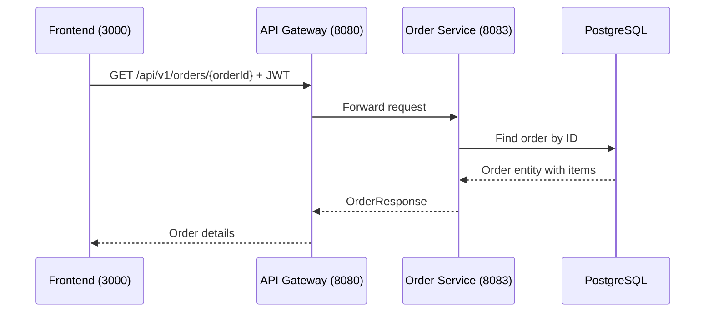

# Get Order

## Purpose
Retrieve order details by order ID.

## Service
**order-service** (Port 8083)

## API Endpoint
| Method | Endpoint | Description |
|--------|----------|-------------|
| GET | `/api/v1/orders/{orderId}` | Get order by ID |

## Flow Diagram



## Request Headers
| Header | Description |
|--------|-------------|
| Authorization | Bearer {JWT token} |

## Path Parameters
| Parameter | Type | Description |
|-----------|------|-------------|
| orderId | Long | Order ID |

## Response
```json
{
  "id": 1,
  "userId": 1,
  "status": "PAID",
  "totalAmount": 299.97,
  "items": [
    {
      "productId": 101,
      "productName": "Wireless Headphones",
      "quantity": 2,
      "unitPrice": 99.99,
      "subtotal": 199.98
    }
  ],
  "shippingAddress": "123 Main St, City, State 12345",
  "createdAt": "2026-02-05T10:00:00Z"
}
```

### Error Responses
| Status | Description |
|--------|-------------|
| 401 | Unauthorized |
| 403 | Forbidden (not owner) |
| 404 | Order not found |

## Acceptance Criteria
- [ ] View order details
- [ ] Only order owner or admin can view
