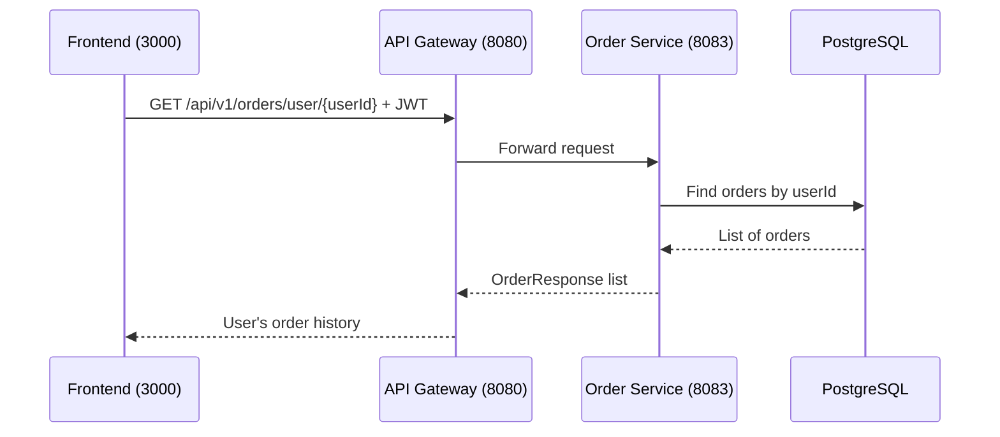

# Get User Orders

## Purpose
Retrieve order history for a specific user.

## Service
**order-service** (Port 8083)

## API Endpoint
| Method | Endpoint | Description |
|--------|----------|-------------|
| GET | `/api/v1/orders/{userId}` | Get orders by user |

## Flow Diagram



## Request Headers
| Header | Description |
|--------|-------------|
| Authorization | Bearer {JWT token} |

## Path Parameters
| Parameter | Type | Description |
|-----------|------|-------------|
| userId | Long | User ID |

## Response
```json
[
  {
    "id": 1,
    "userId": 1,
    "status": "DELIVERED",
    "totalAmount": 299.97,
    "itemCount": 3,
    "createdAt": "2026-01-15T10:00:00Z"
  },
  {
    "id": 2,
    "userId": 1,
    "status": "PAID",
    "totalAmount": 149.99,
    "itemCount": 1,
    "createdAt": "2026-02-01T14:30:00Z"
  }
]
```

### Error Responses
| Status | Description |
|--------|-------------|
| 401 | Unauthorized |
| 403 | Forbidden (not self or admin) |

## Authorization Rules
- **Self-access**: Users can view their own orders
- **Admin-access**: Admins can view any user's orders

## Acceptance Criteria
- [ ] View order history by user
- [ ] Only owner or admin can access
