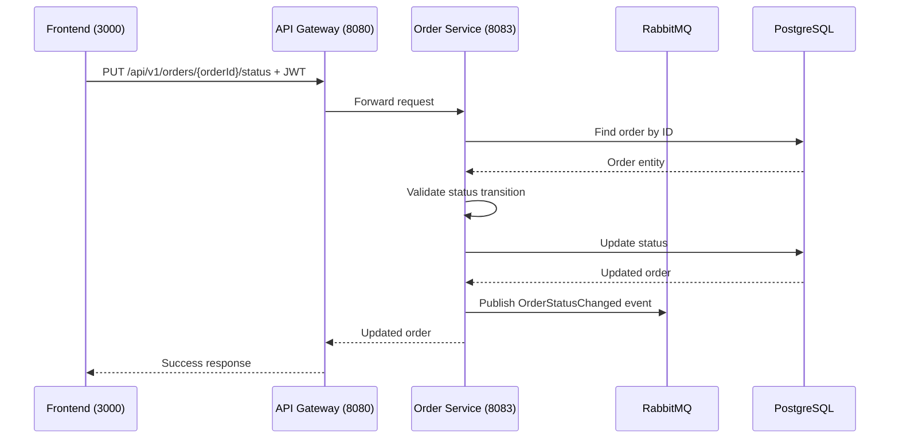

# Update Order Status

## Purpose
Update the status of an order (admin only).

## Service
**order-service** (Port 8083)

## API Endpoint
| Method | Endpoint | Description |
|--------|----------|-------------|
| PUT | `/api/v1/orders/{orderId}/status` | Update order status |

## Flow Diagram



## Request Headers
| Header | Description |
|--------|-------------|
| Authorization | Bearer {JWT token} (Admin only) |

## Path Parameters
| Parameter | Type | Description |
|-----------|------|-------------|
| orderId | Long | Order ID |

## Request Body
```json
{
  "status": "SHIPPED"
}
```

### OrderStatus Values
| Value | Description |
|-------|-------------|
| PENDING | Order created, awaiting payment |
| PAID | Payment successful |
| SHIPPED | Order shipped |
| DELIVERED | Order delivered |
| CANCELLED | Order cancelled |

## Response
```json
{
  "id": 1,
  "status": "SHIPPED",
  "updatedAt": "2026-02-05T12:00:00Z"
}
```

### Error Responses
| Status | Description |
|--------|-------------|
| 400 | Invalid status transition |
| 401 | Unauthorized |
| 403 | Forbidden (not admin) |
| 404 | Order not found |

## Status Transitions
- PENDING → PAID, CANCELLED
- PAID → SHIPPED, CANCELLED
- SHIPPED → DELIVERED
- DELIVERED → (final state)
- CANCELLED → (final state)

## Acceptance Criteria
- [ ] Admin can update order status
- [ ] Validate status transitions
- [ ] Publish event on status change
