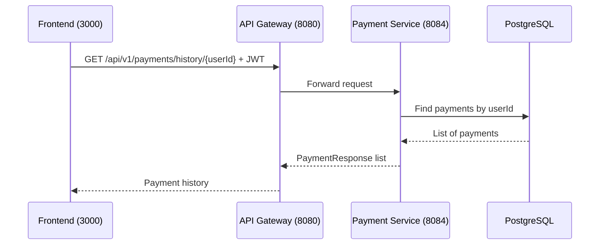

# Get Payment History

## Purpose
Retrieve payment history for a specific user.

## Service
**payment-service** (Port 8084)

## API Endpoint
| Method | Endpoint | Description |
|--------|----------|-------------|
| GET | `/api/v1/payments/history/{userId}` | Get payment history |

## Flow Diagram



## Request Headers
| Header | Description |
|--------|-------------|
| Authorization | Bearer {JWT token} |

## Path Parameters
| Parameter | Type | Description |
|-----------|------|-------------|
| userId | Long | User ID |

## Response
```json
[
  {
    "id": 789,
    "orderId": 123,
    "amount": 99.99,
    "currency": "USD",
    "status": "SUCCESS",
    "createdAt": "2026-02-05T10:01:00Z"
  },
  {
    "id": 790,
    "orderId": 124,
    "amount": 149.99,
    "currency": "USD",
    "status": "REFUNDED",
    "createdAt": "2026-02-04T15:30:00Z"
  }
]
```

### Error Responses
| Status | Description |
|--------|-------------|
| 401 | Unauthorized |
| 403 | Forbidden (not self or admin) |

## Authorization Rules
- **Self-access**: Users can view their own payment history
- **Admin-access**: Admins can view any user's payments

## Acceptance Criteria
- [ ] View payment history by user
- [ ] Only owner or admin can access
