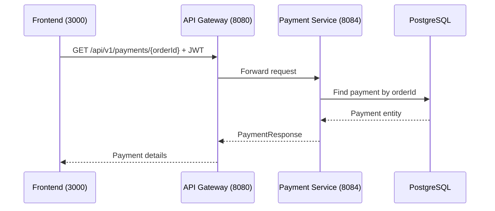

# Get Payment

## Purpose
Retrieve payment details by order ID.

## Service
**payment-service** (Port 8084)

## API Endpoint
| Method | Endpoint | Description |
|--------|----------|-------------|
| GET | `/api/v1/payments/{orderId}` | Get payment by order |

## Flow Diagram



## Request Headers
| Header | Description |
|--------|-------------|
| Authorization | Bearer {JWT token} |

## Path Parameters
| Parameter | Type | Description |
|-----------|------|-------------|
| orderId | Long | Order ID |

## Response
```json
{
  "id": 789,
  "orderId": 123,
  "userId": 456,
  "amount": 99.99,
  "currency": "USD",
  "status": "SUCCESS",
  "transactionId": "ch_xxx",
  "createdAt": "2026-02-05T10:01:00Z"
}
```

### Error Responses
| Status | Description |
|--------|-------------|
| 401 | Unauthorized |
| 403 | Forbidden |
| 404 | Payment not found |

## Acceptance Criteria
- [ ] View payment by order ID
- [ ] Only order owner or admin can view
