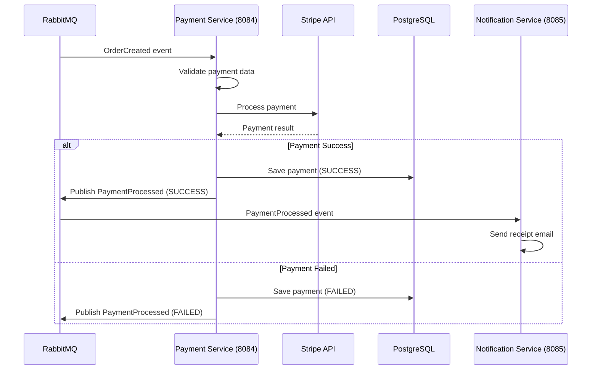

# Process Payment

## Purpose
Process payment for an order, triggered by OrderCreated event or direct API call.

## Service
**payment-service** (Port 8084)

## API Endpoint
| Method | Endpoint | Description |
|--------|----------|-------------|
| POST | `/api/v1/payments/process` | Process payment (direct) |

## Flow Diagram



## Request Body (Direct API)
```json
{
  "orderId": 123,
  "userId": 456,
  "amount": 99.99,
  "paymentMethodId": "pm_card_visa"
}
```

### Request Validation
| Field | Type | Validation |
|-------|------|------------|
| orderId | Long | @NotNull |
| userId | Long | @NotNull |
| amount | BigDecimal | @NotNull, @DecimalMin("0.01") |
| paymentMethodId | String | @NotBlank (Stripe token) |

## Response
```json
{
  "id": 789,
  "orderId": 123,
  "amount": 99.99,
  "currency": "USD",
  "status": "SUCCESS",
  "transactionId": "ch_xxx",
  "createdAt": "2026-02-05T10:01:00Z"
}
```

### Error Responses
| Status | Description |
|--------|-------------|
| 400 | Validation error |
| 402 | Payment declined |
| 409 | Duplicate payment |

## RabbitMQ Event Consumed
```json
{
  "orderId": 123,
  "userId": 456,
  "totalAmount": 99.99,
  "paymentMethodId": "pm_xxx",
  "timestamp": "2026-02-05T10:00:00Z"
}
```

## RabbitMQ Event Published
```json
{
  "paymentId": 789,
  "orderId": 123,
  "status": "SUCCESS",
  "transactionId": "ch_xxx",
  "timestamp": "2026-02-05T10:01:00Z"
}
```

## Data Model

### Payment Entity
| Field | Type | Constraints |
|-------|------|-------------|
| id | Long | Primary Key |
| orderId | Long | Required, Unique |
| userId | Long | Required |
| amount | BigDecimal | Required, > 0 |
| currency | String | Default: "USD" |
| status | PaymentStatus | PENDING, SUCCESS, FAILED, REFUNDED |
| transactionId | String | External provider ID |
| errorMessage | String | Nullable |
| createdAt | LocalDateTime | Auto-generated |

## Acceptance Criteria
- [ ] Consume OrderCreated event and process payment
- [ ] Integrate with Stripe API for card payments
- [ ] Publish PaymentProcessed event
- [ ] Store payment records in database
- [ ] Idempotent processing (no duplicate charges)
