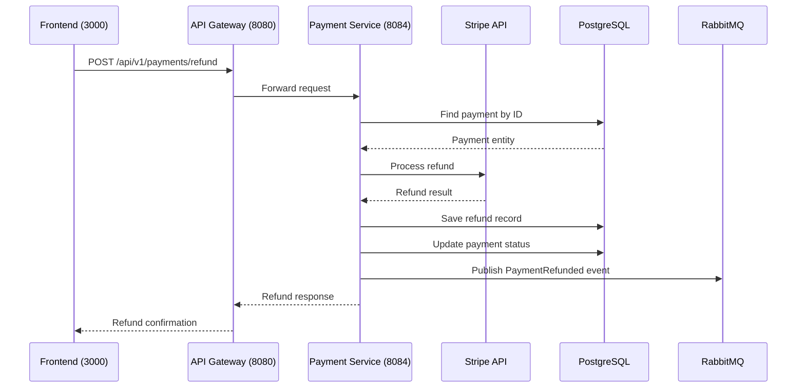

# Refund Payment

## Purpose
Process a refund for a completed payment.

## Service
**payment-service** (Port 8084)

## API Endpoint
| Method | Endpoint | Description |
|--------|----------|-------------|
| POST | `/api/v1/payments/refund` | Process refund |

## Flow Diagram



## Request Headers
| Header | Description |
|--------|-------------|
| Authorization | Bearer {JWT token} (Admin only) |

## Request Body
```json
{
  "paymentId": 789,
  "amount": 50.00,
  "reason": "Customer requested refund"
}
```

### Request Validation
| Field | Type | Validation |
|-------|------|------------|
| paymentId | Long | @NotNull |
| amount | BigDecimal | @NotNull (optional, defaults to full) |
| reason | String | Optional |

## Response
```json
{
  "id": 1,
  "paymentId": 789,
  "amount": 50.00,
  "reason": "Customer requested refund",
  "status": "SUCCESS",
  "refundTransactionId": "re_xxx",
  "createdAt": "2026-02-05T12:00:00Z"
}
```

### Error Responses
| Status | Description |
|--------|-------------|
| 400 | Invalid refund amount |
| 401 | Unauthorized |
| 403 | Forbidden (not admin) |
| 404 | Payment not found |
| 409 | Already refunded |

## RabbitMQ Event Published
```json
{
  "paymentId": 789,
  "orderId": 123,
  "refundAmount": 50.00,
  "timestamp": "2026-02-05T12:00:00Z"
}
```

## Acceptance Criteria
- [ ] Process refunds with admin authorization
- [ ] Support partial and full refunds
- [ ] Publish PaymentRefunded event
