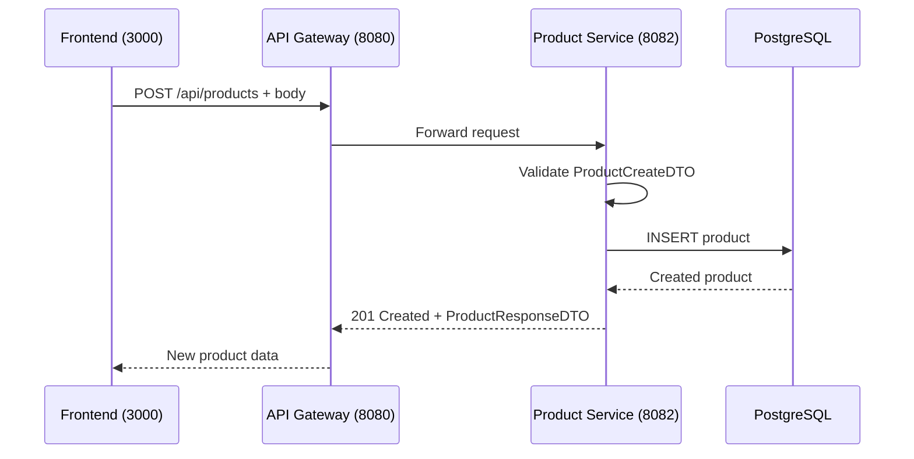

# Create Product

## Purpose
Add a new product to the e-commerce catalog.

## Service
**product-service** (Port 8082)

## API Endpoint
| Method | Endpoint | Description |
|--------|----------|-------------|
| POST | `/api/products` | Create new product |

## Flow Diagram



## Request Body
```json
{
  "name": "Wireless Headphones",
  "description": "High-quality bluetooth headphones",
  "price": 99.99,
  "stock": 50,
  "category": "Electronics",
  "imageUrl": "https://example.com/headphones.jpg"
}
```

### Request Validation
| Field | Type | Validation |
|-------|------|------------|
| name | String | @NotBlank |
| description | String | Optional |
| price | BigDecimal | @NotNull, @DecimalMin("0.0") |
| stock | Integer | Default: 0 |
| category | String | Optional |
| imageUrl | String | Optional |

## Response
```json
{
  "id": 1,
  "name": "Wireless Headphones",
  "description": "High-quality bluetooth headphones",
  "price": 99.99,
  "stock": 50,
  "category": "Electronics",
  "imageUrl": "https://example.com/headphones.jpg",
  "active": true,
  "createdAt": "2026-02-05T10:00:00Z",
  "updatedAt": "2026-02-05T10:00:00Z"
}
```

### Error Responses
| Status | Description |
|--------|-------------|
| 400 | Validation error |

## Data Model

### Product Entity
| Field | Type | Constraints |
|-------|------|-------------|
| id | Long | Primary Key, Auto-generated |
| name | String | Required, max 255 chars |
| description | String | Optional, TEXT type |
| price | BigDecimal | Required, > 0.0 |
| stock | Integer | Required |
| category | String | Optional, max 100 chars |
| imageUrl | String | Optional |
| active | Boolean | Required (soft delete flag) |
| createdAt | LocalDateTime | Auto-generated |
| updatedAt | LocalDateTime | Auto-updated |

## Key Implementation Files
- [ProductController.java](file:///Users/ahnguyentran/Documents/Personal/study-microservice/product-service/src/main/java/com/example/product_service/controller/ProductController.java)
- [Product.java](file:///Users/ahnguyentran/Documents/Personal/study-microservice/product-service/src/main/java/com/example/product_service/entity/Product.java)
- [ProductService.java](file:///Users/ahnguyentran/Documents/Personal/study-microservice/product-service/src/main/java/com/example/product_service/service/ProductService.java)

## Acceptance Criteria
- [x] Create new products with validation
- [x] Products are active by default
- [x] OpenAPI documentation with Swagger
