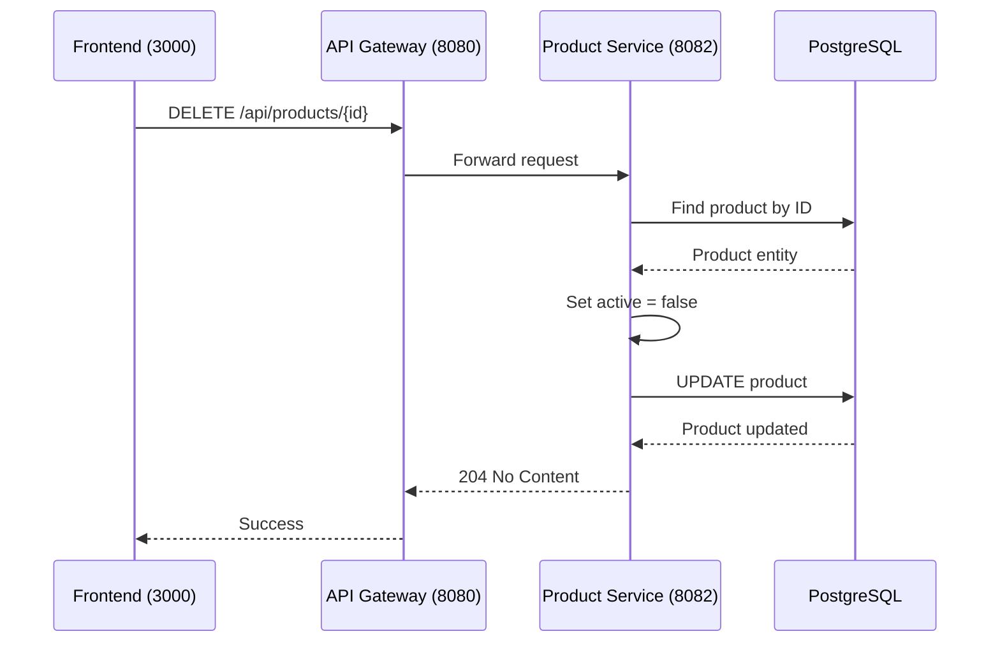

# Delete Product

## Purpose
Soft delete a product (mark as inactive) from the catalog.

## Service
**product-service** (Port 8082)

## API Endpoint
| Method | Endpoint | Description |
|--------|----------|-------------|
| DELETE | `/api/products/{id}` | Soft delete product |

## Flow Diagram

## Path Parameters
| Parameter | Type | Description |
|-----------|------|-------------|
| id | Long | Product ID to delete |

## Response
- **204 No Content** on success

### Error Responses
| Status | Description |
|--------|-------------|
| 404 | Product not found |

## Notes
- This is a **soft delete** - the product is marked as `active = false`
- Soft-deleted products are excluded from normal queries
- Data is preserved for order history references

## Key Implementation Files
- [ProductController.java](file:///Users/ahnguyentran/Documents/Personal/study-microservice/product-service/src/main/java/com/example/product_service/controller/ProductController.java)
- [ProductService.java](file:///Users/ahnguyentran/Documents/Personal/study-microservice/product-service/src/main/java/com/example/product_service/service/ProductService.java)

## Acceptance Criteria
- [x] Soft delete products (mark as inactive)
- [x] Deleted products excluded from normal queries
