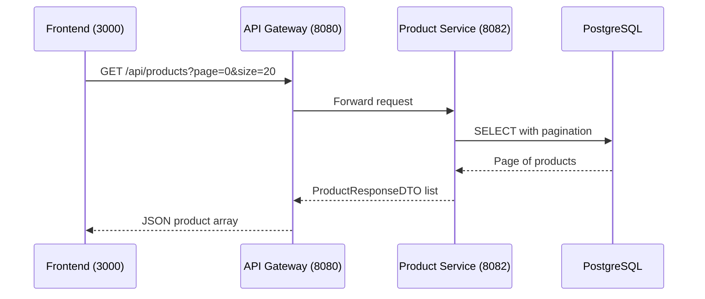

# Get All Products

## Purpose
Retrieve all products with pagination and sorting support.

## Service
**product-service** (Port 8082)

## API Endpoint
| Method | Endpoint | Description |
|--------|----------|-------------|
| GET | `/api/products` | Get all products (paginated) |

## Flow Diagram



## Query Parameters
| Param | Type | Default | Description |
|-------|------|---------|-------------|
| page | int | 0 | Page number (0-based) |
| size | int | 20 | Page size |
| sortBy | String | "name" | Sort field |
| sortDir | String | "asc" | Sort direction (asc/desc) |

## Response
```json
{
  "content": [
    {
      "id": 1,
      "name": "Wireless Headphones",
      "description": "High-quality bluetooth headphones",
      "price": 99.99,
      "stock": 50,
      "category": "Electronics",
      "active": true,
      "createdAt": "2026-02-05T10:00:00Z"
    }
  ],
  "totalElements": 100,
  "totalPages": 5,
  "size": 20,
  "number": 0
}
```

## Key Implementation Files
- [ProductController.java](file:///Users/ahnguyentran/Documents/Personal/study-microservice/product-service/src/main/java/com/example/product_service/controller/ProductController.java)
- [ProductService.java](file:///Users/ahnguyentran/Documents/Personal/study-microservice/product-service/src/main/java/com/example/product_service/service/ProductService.java)

## Acceptance Criteria
- [x] View all products with pagination
- [x] Support sorting by field and direction
