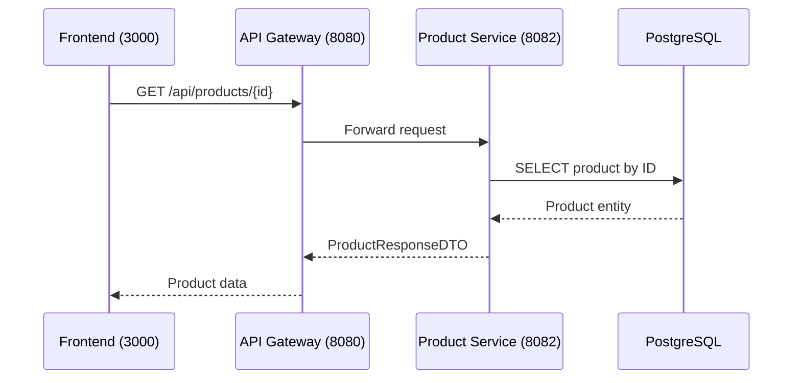

# Get Product

## Purpose
Retrieve a single product by its ID.

## Service
**product-service** (Port 8082)

## API Endpoint
| Method | Endpoint | Description |
|--------|----------|-------------|
| GET | `/api/products/{id}` | Get product by ID |

## Flow Diagram



## Path Parameters
| Parameter | Type | Description |
|-----------|------|-------------|
| id | Long | Product ID |

## Response
```json
{
  "id": 1,
  "name": "Wireless Headphones",
  "description": "High-quality bluetooth headphones",
  "price": 99.99,
  "stock": 50,
  "category": "Electronics",
  "imageUrl": "https://example.com/headphones.jpg",
  "active": true,
  "createdAt": "2026-02-05T10:00:00Z",
  "updatedAt": "2026-02-05T10:00:00Z"
}
```

### Error Responses
| Status | Description |
|--------|-------------|
| 404 | Product not found |

## Key Implementation Files
- [ProductController.java](file:///Users/ahnguyentran/Documents/Personal/study-microservice/product-service/src/main/java/com/example/product_service/controller/ProductController.java)
- [ProductService.java](file:///Users/ahnguyentran/Documents/Personal/study-microservice/product-service/src/main/java/com/example/product_service/service/ProductService.java)

## Acceptance Criteria
- [x] View single product by ID
- [x] Returns 404 if not found
