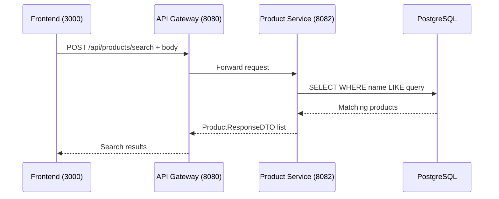

# Search Products

## Purpose
Search products by name with partial matching.

## Service
**product-service** (Port 8082)

## API Endpoint
| Method | Endpoint | Description |
|--------|----------|-------------|
| POST | `/api/products/search` | Search products by name |

## Flow Diagram



## Request Body
```json
{
  "query": "laptop"
}
```

## Response
```json
[
  {
    "id": 1,
    "name": "Gaming Laptop",
    "description": "High-performance gaming laptop",
    "price": 1299.99,
    "stock": 10,
    "category": "Computers",
    "active": true
  },
  {
    "id": 2,
    "name": "Business Laptop",
    "description": "Professional business laptop",
    "price": 899.99,
    "stock": 25,
    "category": "Computers",
    "active": true
  }
]
```

### Error Responses
| Status | Description |
|--------|-------------|
| 400 | Invalid search query |

## Notes
- Search is case-insensitive
- Uses partial matching (LIKE %query%)
- Only returns active products

## Key Implementation Files
- [ProductController.java](file:///Users/ahnguyentran/Documents/Personal/study-microservice/product-service/src/main/java/com/example/product_service/controller/ProductController.java)
- [ProductService.java](file:///Users/ahnguyentran/Documents/Personal/study-microservice/product-service/src/main/java/com/example/product_service/service/ProductService.java)

## Acceptance Criteria
- [x] Search products by name
- [x] Case-insensitive partial matching
