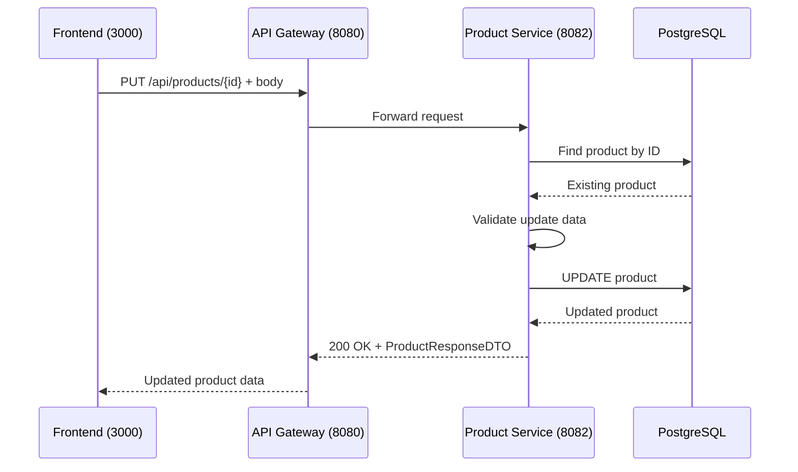

# Update Product

## Purpose
Update an existing product's information.

## Service
**product-service** (Port 8082)

## API Endpoint
| Method | Endpoint | Description |
|--------|----------|-------------|
| PUT | `/api/products/{id}` | Update product |

## Flow Diagram



## Path Parameters
| Parameter | Type | Description |
|-----------|------|-------------|
| id | Long | Product ID to update |

## Request Body
```json
{
  "name": "Updated Headphones",
  "description": "Updated description",
  "price": 89.99,
  "stock": 100,
  "category": "Electronics",
  "imageUrl": "https://example.com/new-headphones.jpg"
}
```

## Response
```json
{
  "id": 1,
  "name": "Updated Headphones",
  "description": "Updated description",
  "price": 89.99,
  "stock": 100,
  "category": "Electronics",
  "imageUrl": "https://example.com/new-headphones.jpg",
  "active": true,
  "createdAt": "2026-02-05T10:00:00Z",
  "updatedAt": "2026-02-05T12:00:00Z"
}
```

### Error Responses
| Status | Description |
|--------|-------------|
| 400 | Validation error |
| 404 | Product not found |

## Key Implementation Files
- [ProductController.java](file:///Users/ahnguyentran/Documents/Personal/study-microservice/product-service/src/main/java/com/example/product_service/controller/ProductController.java)
- [ProductService.java](file:///Users/ahnguyentran/Documents/Personal/study-microservice/product-service/src/main/java/com/example/product_service/service/ProductService.java)

## Acceptance Criteria
- [x] Update existing products
- [x] Validation on update data
- [x] Returns 404 if product not found
