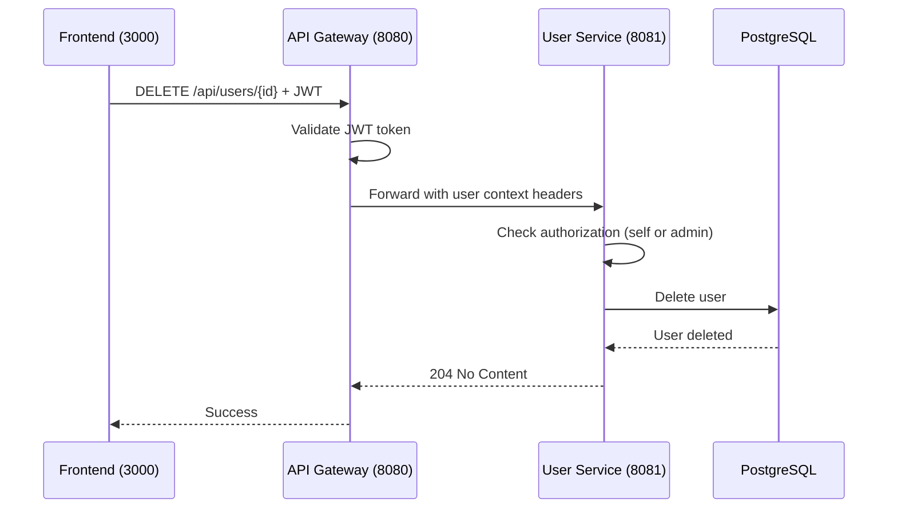

# Delete User

## Purpose
Delete a user account from the system.

## Service
**user-service** (Port 8081)

## API Endpoint
| Method | Endpoint | Description |
|--------|----------|-------------|
| DELETE | `/api/users/{id}` | Delete user |

## Flow Diagram

## Request Headers
| Header | Description |
|--------|-------------|
| Authorization | Bearer {JWT token} |

## Path Parameters
| Parameter | Type | Description |
|-----------|------|-------------|
| id | Long | User ID to delete |

## Response
- **204 No Content** on success

### Error Responses
| Status | Description |
|--------|-------------|
| 401 | Unauthorized |
| 403 | Forbidden (not self or admin) |
| 404 | User not found |

## Authorization Rules
- **Self-delete**: Users can delete their own account
- **Admin-delete**: Admins can delete any user

## Key Implementation Files
- [UserController.java](file:///Users/ahnguyentran/Documents/Personal/study-microservice/user-service/src/main/java/com/microservices/userservice/controller/UserController.java)
- [UserService.java](file:///Users/ahnguyentran/Documents/Personal/study-microservice/user-service/src/main/java/com/microservices/userservice/service/UserService.java)

## Acceptance Criteria
- [x] Users can delete their own account
- [x] Admins can delete any user
- [x] Returns 403 for unauthorized deletion attempts
