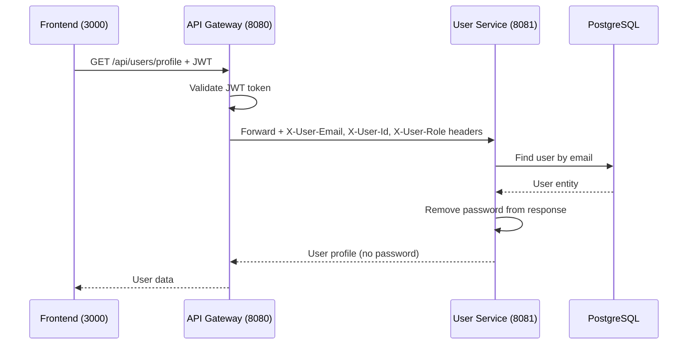

# Get User Profile

## Purpose
Retrieve the authenticated user's profile information.

## Service
**user-service** (Port 8081)

## API Endpoint
| Method | Endpoint | Description |
|--------|----------|-------------|
| GET | `/api/users/profile` | Get current user's profile |
| GET | `/api/users/{id}` | Get user by ID (self or admin) |

## Flow Diagram



## Request Headers
| Header | Description |
|--------|-------------|
| Authorization | Bearer {JWT token} |

### Headers Injected by API Gateway
| Header | Description |
|--------|-------------|
| X-User-Email | Authenticated user's email |
| X-User-Id | Authenticated user's ID |
| X-User-Role | User's role (USER/ADMIN) |

## Response
```json
{
  "id": 1,
  "email": "john@example.com",
  "firstName": "John",
  "lastName": "Doe",
  "phone": "+1234567890",
  "address": "123 Main St",
  "role": "USER",
  "createdAt": "2026-01-01T00:00:00Z"
}
```

### Error Responses
| Status | Description |
|--------|-------------|
| 401 | Unauthorized (no/invalid token) |
| 403 | Forbidden (accessing other user's profile) |
| 404 | User not found |

## Authorization Rules
- **Self-access**: Users can view their own profile
- **Admin-access**: Admins can view any user's profile

## Key Implementation Files
- [UserController.java](file:///Users/ahnguyentran/Documents/Personal/study-microservice/user-service/src/main/java/com/microservices/userservice/controller/UserController.java)
- [UserService.java](file:///Users/ahnguyentran/Documents/Personal/study-microservice/user-service/src/main/java/com/microservices/userservice/service/UserService.java)

## Acceptance Criteria
- [x] Authenticated users can view their profile
- [x] Passwords are never exposed in responses
- [x] User context passed via API Gateway headers
