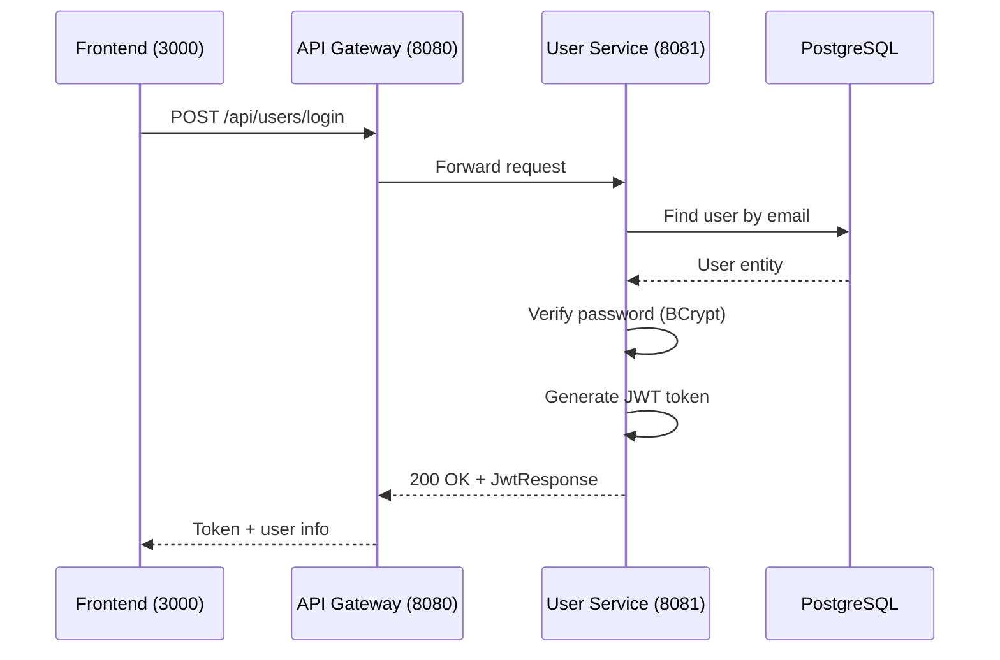

# Login User

## Purpose
Authenticate user with email/password and return JWT token for subsequent API calls.

## Service
**user-service** (Port 8081)

## API Endpoint
| Method | Endpoint | Description |
|--------|----------|-------------|
| POST | `/api/users/login` | Authenticate user, return JWT |

## Flow Diagram



## Request Body
```json
{
  "email": "john@example.com",
  "password": "securePassword123"
}
```

### Request Validation
| Field | Type | Validation |
|-------|------|------------|
| email | String | @Email, @NotBlank |
| password | String | @NotBlank |

## Response
```json
{
  "token": "eyJhbGciOiJIUzI1NiIsInR5cCI6IkpXVCJ9...",
  "type": "Bearer",
  "id": 1,
  "email": "john@example.com",
  "firstName": "John",
  "lastName": "Doe",
  "role": "USER"
}
```

### Error Responses
| Status | Description |
|--------|-------------|
| 400 | Validation error |
| 401 | Invalid credentials |
| 404 | User not found |

## Configuration
```yaml
jwt:
  secret: <your-secret-key>
  expiration: 86400000  # 24 hours in ms
```

## Key Implementation Files
- [AuthController.java](file:///Users/ahnguyentran/Documents/Personal/study-microservice/user-service/src/main/java/com/microservices/userservice/controller/AuthController.java)
- [JwtUtils.java](file:///Users/ahnguyentran/Documents/Personal/study-microservice/user-service/src/main/java/com/microservices/userservice/security/JwtUtils.java)

## Acceptance Criteria
- [x] User can login with valid credentials
- [x] Returns JWT token on success
- [x] Invalid credentials return 401
- [x] Token contains user info and role
