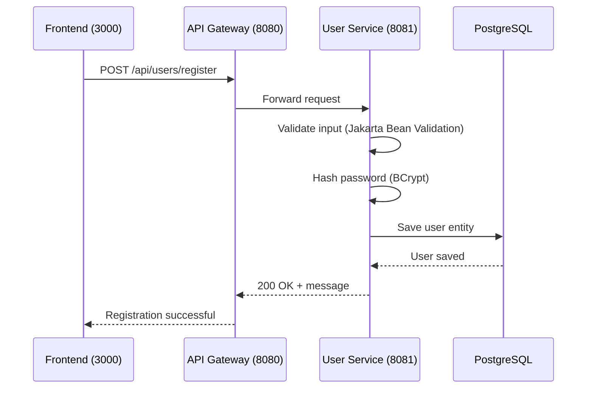

# Register User

## Purpose
Register a new user account in the e-commerce platform with email/password authentication.

## Service
**user-service** (Port 8081)

## API Endpoint
| Method | Endpoint | Description |
|--------|----------|-------------|
| POST | `/api/users/register` | Register new user |

## Flow Diagram



## Request Body
```json
{
  "email": "john@example.com",
  "password": "securePassword123",
  "firstName": "John",
  "lastName": "Doe",
  "phone": "+1234567890",
  "address": "123 Main St"
}
```

### Request Validation
| Field | Type | Validation |
|-------|------|------------|
| email | String | @Email, @NotBlank |
| password | String | @NotBlank, @Size(min=6) |
| firstName | String | @NotBlank |
| lastName | String | @NotBlank |
| phone | String | Optional |
| address | String | Optional |

## Response
```json
{
  "message": "User registered successfully"
}
```

### Error Responses
| Status | Description |
|--------|-------------|
| 400 | Validation error (invalid email, short password) |
| 409 | Email already exists |

## Data Model

### User Entity
| Field | Type | Constraints |
|-------|------|-------------|
| id | Long | Primary Key, Auto-generated |
| email | String | Unique, Required, Valid email |
| password | String | Required, Min 6 chars (stored as BCrypt hash) |
| firstName | String | Required |
| lastName | String | Required |
| phone | String | Optional |
| address | String | Optional |
| role | UserRole | Enum: USER, ADMIN (default: USER) |
| enabled | Boolean | Default: true |
| createdAt | LocalDateTime | Auto-generated |
| updatedAt | LocalDateTime | Auto-updated |

## Key Implementation Files
- [AuthController.java](file:///Users/ahnguyentran/Documents/Personal/study-microservice/user-service/src/main/java/com/microservices/userservice/controller/AuthController.java)
- [User.java](file:///Users/ahnguyentran/Documents/Personal/study-microservice/user-service/src/main/java/com/microservices/userservice/model/User.java)

## Acceptance Criteria
- [x] User can register with email/password
- [x] Passwords are hashed with BCrypt
- [x] Input validation with error messages
- [x] Duplicate email returns 409 Conflict
