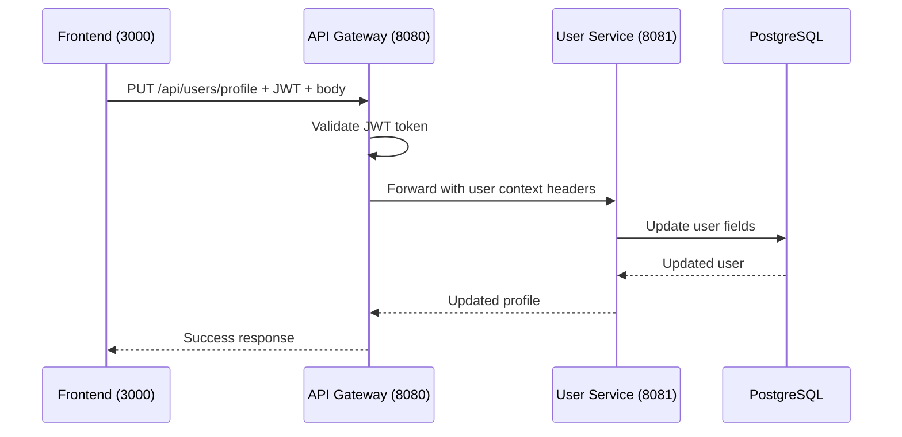

# Update User Profile

## Purpose
Update the authenticated user's profile information.

## Service
**user-service** (Port 8081)

## API Endpoint
| Method | Endpoint | Description |
|--------|----------|-------------|
| PUT | `/api/users/profile` | Update current user's profile |

## Flow Diagram



## Request Headers
| Header | Description |
|--------|-------------|
| Authorization | Bearer {JWT token} |
| Content-Type | application/json |

## Request Body
```json
{
  "firstName": "John",
  "lastName": "Doe",
  "phone": "+1234567890",
  "address": "456 New St"
}
```

### Editable Fields
| Field | Type | Editable |
|-------|------|----------|
| firstName | String | Yes |
| lastName | String | Yes |
| phone | String | Yes |
| address | String | Yes |
| email | String | No (immutable) |
| password | String | No (separate endpoint) |

## Response
```json
{
  "id": 1,
  "email": "john@example.com",
  "firstName": "John",
  "lastName": "Doe",
  "phone": "+1234567890",
  "address": "456 New St",
  "role": "USER",
  "updatedAt": "2026-02-05T10:00:00Z"
}
```

### Error Responses
| Status | Description |
|--------|-------------|
| 400 | Validation error |
| 401 | Unauthorized |
| 403 | Forbidden |

## Key Implementation Files
- [UserController.java](file:///Users/ahnguyentran/Documents/Personal/study-microservice/user-service/src/main/java/com/microservices/userservice/controller/UserController.java)
- [UserService.java](file:///Users/ahnguyentran/Documents/Personal/study-microservice/user-service/src/main/java/com/microservices/userservice/service/UserService.java)

## Acceptance Criteria
- [x] Authenticated users can update their profile
- [x] Email cannot be changed
- [x] Password update via separate endpoint
